# 🎓 CampusIntel
## Campus Event Attendance Prediction & Engagement Intelligence Dashboard

<div align="center">


</div>

---

## 📋 Overview

CampusIntel is a **full-stack, explainable machine learning dashboard** that predicts **expected attendance** for university events (**Low / Medium / High**) based on event characteristics, engagement factors, and friction indicators.

Unlike intuition-driven event planning, this system focuses on **data-driven forecasting, interpretability, and actionable recommendations**, answering three core questions:

1. **What is the predicted attendance?**  
2. **Why is attendance predicted to be high or low?**  
3. **What can be improved to boost engagement?**

> ⚠️ **Academic Disclaimer**  
> This project is developed strictly for academic and demonstration purposes.  
> The system provides **statistical predictions** to support decision-making, not guaranteed attendance figures.

---

## 📌 Table of Contents

- [Project Motivation](#project-motivation)
- [What This System Delivers](#what-this-system-delivers)
- [System Architecture](#system-architecture)
- [End-to-End Data Flow](#end-to-end-data-flow)
- [Technology Stack](#technology-stack)
- [Repository Structure](#repository-structure)
- [Dashboard Capabilities](#dashboard-capabilities)
- [Machine Learning Model](#machine-learning-model)
- [Explainability Methodology](#explainability-methodology)
- [API Design](#api-design)
- [Local Setup](#local-setup)
- [Model Versioning & Lifecycle](#model-versioning--lifecycle)
- [Limitations](#limitations)
- [Future Improvements](#future-improvements)

---

## 🎯 Project Motivation

University event planning is largely **intuition-driven**, resulting in:

- ❌ Poor attendance forecasting  
- ❌ Inefficient promotion strategies  
- ❌ Low student engagement  
- ❌ Wasted logistical resources  

CampusIntel addresses this gap by:

- 📊 Learning from historical engagement patterns  
- 🤖 Training **interpretable models (Linear Regression, SVR, Random Forest)**  
- 🖥️ Deploying via a **professional dashboard interface**  
- 📈 Visually explaining *why* attendance is predicted to be high or low  

This project satisfies academic requirements for:

- Dataset generation and justification  
- Multiple ML model comparison  
- Visual dashboard with interactive predictions  
- Model versioning and registry  
- Production-ready architecture  

---

## ✅ What This System Delivers

| Feature | Description |
|---------|-------------|
| ✅ Attendance Prediction | Numeric expected attendance with confidence intervals |
| ✅ Engagement Categories | 3-level classification (Low < 70 / Medium 70-120 / High > 120) |
| ✅ Model Comparison | Side-by-side Linear Regression, SVR, and Random Forest |
| ✅ High Performance | R² ≈ **0.76** with Linear Regression (best model) |
| ✅ Model Persistence | Joblib-based reusable ML models with versioning |
| ✅ Interactive Dashboard | Real-time predictions with dynamic visualizations |
| ✅ Intelligent Recommendations | Context-aware suggestions to improve attendance |
| ✅ SQLite Integration | Database-first design for real-world deployment |
| ✅ Modern UI | Professional dashboard with Tailwind CSS and shadcn/ui |

---

## 🏗️ System Architecture

### High-Level Architecture

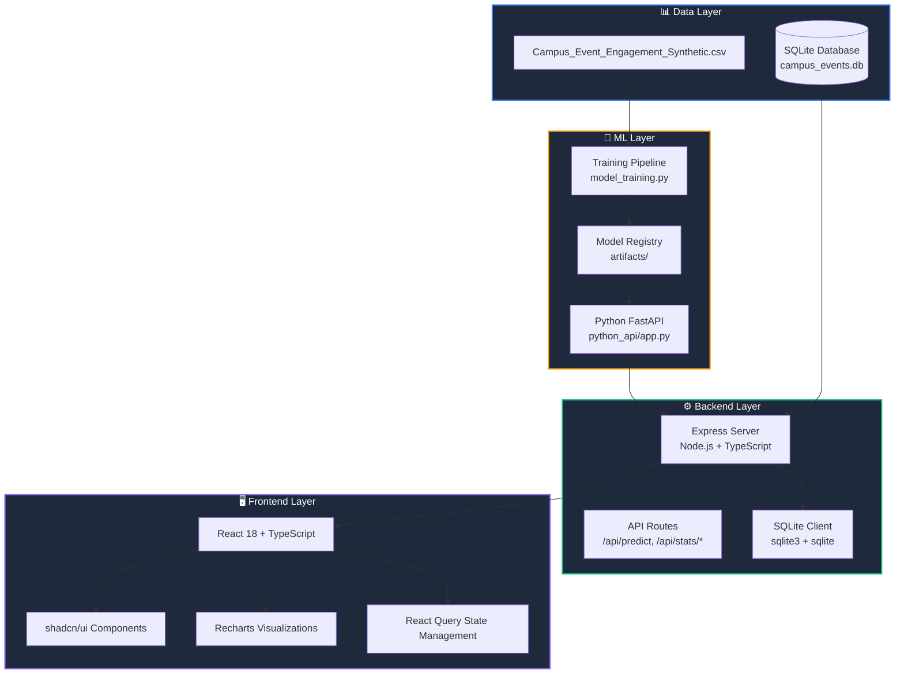

### Component Architecture

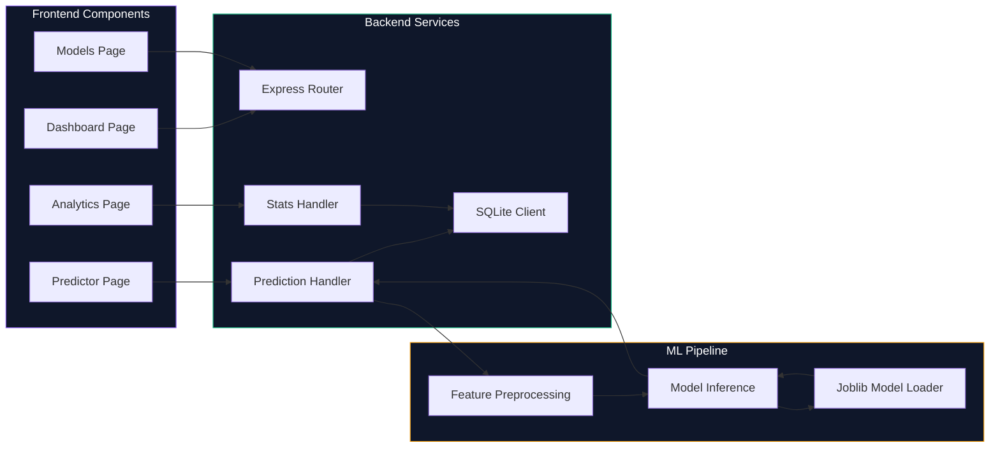

---

## 🔄 End-to-End Data Flow

### Prediction Request Flow

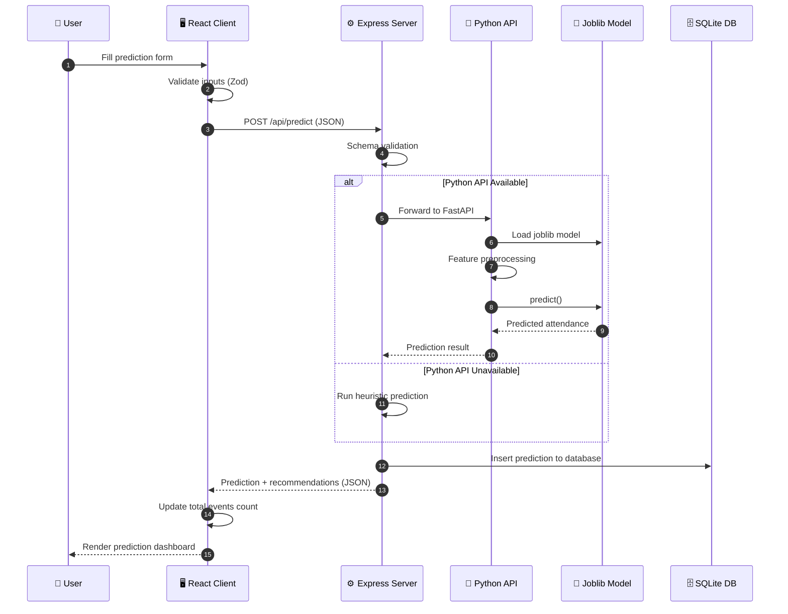

### Training Data Flow

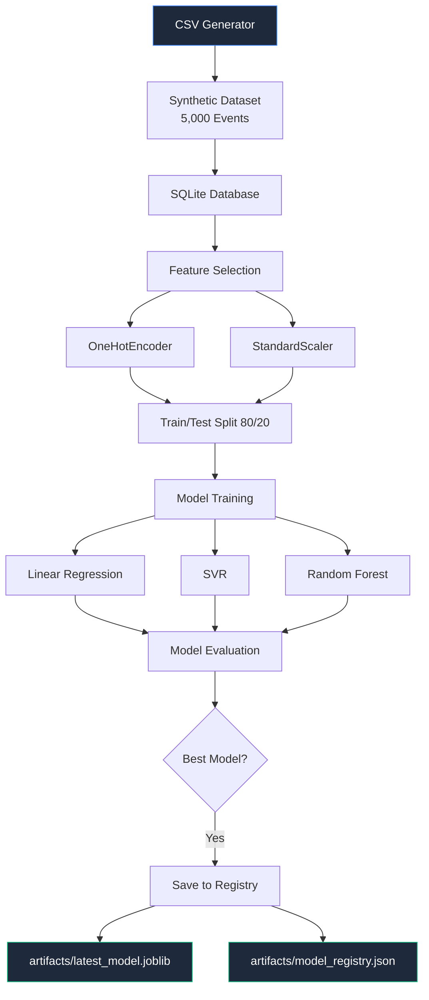

---

## 🛠️ Technology Stack

### Frontend Stack

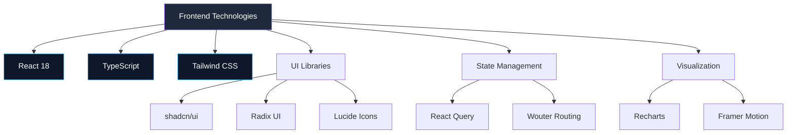

### Backend Stack

```mermaid
graph TD
    A[Backend Technologies] --> B[Node.js]
    A --> C[Express]
    A --> D[TypeScript]
    
    A --> E[Database]
    E --> E1[SQLite3]
    E --> E2[sqlite (async)]
    
    A --> F[Validation]
    F --> F1[Zod Schemas]
    
    A --> G[Python Integration]
    G --> G1[HTTP to FastAPI]
    G --> G2[Fallback Heuristic]
    
    style A fill:#1e293b,stroke:#10b981,color:#fff
    style B fill:#0f172a,stroke:#339933,color:#fff
    style C fill:#0f172a,stroke:#000000,color:#fff
```

### Machine Learning Stack

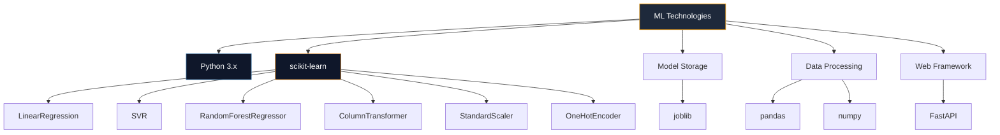

---

## 📁 Repository Structure

```
Hackathon-3-Rajdeep/
│
├── 📂 Data_generator/                  # Synthetic data generation
│   └── generate_data.py                # Creates 5,000 synthetic events
│
├── 📂 Training_model/                  # ML model training
│   └── model_training.py               # Trains and evaluates 3 models
│
├── 📂 artifacts/                       # Model registry and artifacts
│   ├── best_model.joblib                # Best performing model
│   ├── encoder.joblib                   # Feature encoder
│   ├── latest_model.joblib              # Latest trained model
│   ├── model_registry.json              # Model metadata registry
│   └── model_v*/                        # Versioned model folders
│
├── 📂 checking_predicting/             # Prediction scripts
│   ├── checking_db.py                   # Database checker
│   ├── list_models.py                   # Model registry viewer
│   ├── predicting.py                    # Python prediction script
│   └── terminal_predictor.py          # CLI prediction tool
│
├── 📂 database/                        # SQLite database
│   ├── campus_events.db                 # Main database
│   └── storing_db.py                    # CSV to DB loader
│
├── 📂 saved model/                     # Alternative model storage
│
├── 📂 Event-Insights-Hub/              # Full-stack dashboard
│   ├── 📂 client/                       # Frontend application
│   │   ├── 📂 src/
│   │   │   ├── 📂 pages/
│   │   │   │   ├── Dashboard.tsx        # Overview dashboard
│   │   │   │   ├── Predictor.tsx        # Prediction form
│   │   │   │   ├── Analytics.tsx        # Detailed analytics
│   │   │   │   └── Models.tsx           # Model registry view
│   │   │   │
│   │   │   ├── 📂 components/
│   │   │   │   ├── Sidebar.tsx          # Navigation sidebar
│   │   │   │   ├── StatCard.tsx         # Dashboard stat cards
│   │   │   │   └── MobileNav.tsx        # Mobile navigation
│   │   │   │
│   │   │   ├── 📂 hooks/
│   │   │   │   └── use-campus-intel.ts  # React Query hooks
│   │   │   │
│   │   │   ├── App.tsx                  # Root component
│   │   │   └── main.tsx                 # Entry point
│   │   │
│   │   ├── package.json
│   │   └── tailwind.config.ts
│   │
│   ├── 📂 server/                       # Backend application
│   │   ├── index.ts                     # Express server entry
│   │   ├── routes.ts                    # API route handlers
│   │   └── db.ts                        # SQLite connection
│   │
│   ├── 📂 python_api/                   # Python inference API
│   │   ├── app.py                       # FastAPI application
│   │   └── requirements.txt             # Python dependencies
│   │
│   ├── 📂 shared/                       # Shared schemas
│   │   └── routes.ts                    # API contracts (Zod)
│   │
│   ├── package.json
│   └── README.md
│
├── Campus_Event_Engagement_Synthetic.csv  # Synthetic dataset
└── README.md                             # This file
```

---

## 📊 Dashboard Capabilities

### Dashboard Overview

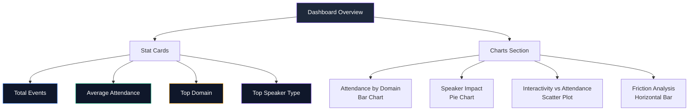

### Prediction Form

| Input Category | Fields | Input Type |
|----------------|--------|------------|
| **Event Info** | Domain, Event Type, Speaker Type | Dropdown Select |
| **Timing** | Day Type, Time Slot | Dropdown Select |
| **Duration** | Duration (Hours) | Number Input (0.5-5.0) |
| **Promotion** | Promotion Days | Number Input (0-30) |
| **Incentives** | Certificate Flag | Toggle Switch |
| **Engagement** | Interactivity Level | Slider (0.0-1.0) |
| **Frictions** | Relevance, Schedule, Fatigue, Promotion, Social, Format | Sliders (1-5) |

### Prediction Output

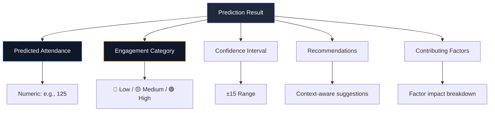

### Intelligent Recommendations Engine

The system generates context-aware recommendations such as:

- 📢 "Increase promotion days to improve turnout."  
- ⏰ "High schedule friction detected — consider changing time slot."  
- 🎮 "Interactivity is low compared to high-attendance events."  
- 🎤 "Industry speakers historically perform better for this domain."  
- 😴 "High student fatigue detected. Consider a more relaxed event format."  
- 🎯 "Relevance friction is high. Align content more closely with student career goals."  

---

## 🤖 Machine Learning Model

### Model Types Implemented

1. **Linear Regression** (Selected Model)
   - Baseline approach
   - Highly interpretable
   - Fast and stable
   - Best R² score: **0.76**

2. **Support Vector Regression (SVR)**
   - Captures non-linear patterns
   - Robust to noise
   - R²: **0.74**

3. **Random Forest Regressor**
   - Captures complex feature interactions
   - Feature importance analysis
   - R²: **0.63**

### Performance Summary

| Model | RMSE | MAE | R² |
|-------|------|-----|-----|
| **Linear Regression** | ~14.76 | ~12.22 | ~0.76 |
| **SVR** | ~15.42 | ~12.68 | ~0.74 |
| **Random Forest** | ~18.24 | ~14.76 | ~0.63 |

### Model Selection Justification

Linear Regression was selected as the final model because:

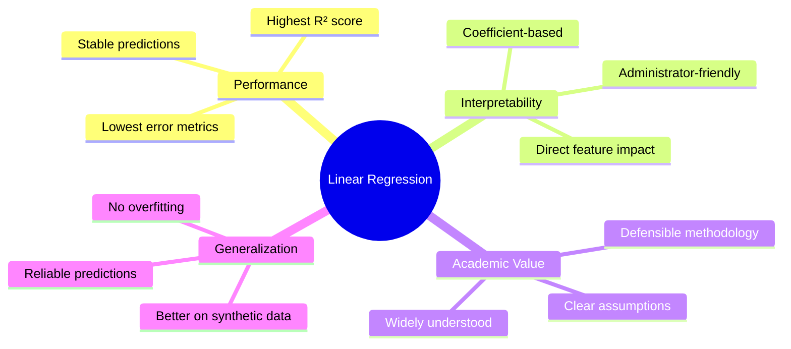

### Model Training Pipeline

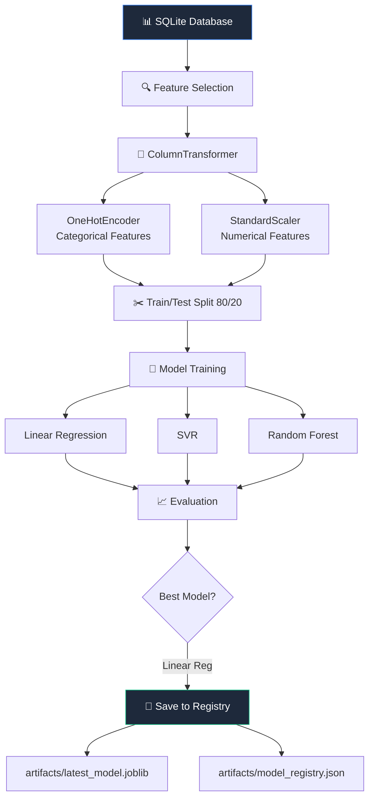

---

## 🔍 Explainability Methodology

### Core Principle

Linear regression computes attendance using:

```
Attendance = Intercept + Σ(feature_i × coefficient_i)
```

This allows direct estimation of:
- ✅ Factors increasing attendance (positive coefficients)
- ✅ Factors decreasing attendance (negative coefficients)

### Feature Categories

```mermaid
graph TD
    A["Model Features"] --> B["Event Context"]
    A --> C["Promotion & Incentives"]
    A --> D["Engagement Drivers"]
    A --> E["Friction Factors"]
    
    B --> B1["Domain"]
    B --> B2["Event Type"]
    B --> B3["Speaker Type"]
    B --> B4["Duration"]
    B --> B5["Day Type"]
    B --> B6["Time Slot"]
    
    C --> C1["Promotion Days"]
    C --> C2["Certificate Flag"]
    
    D --> D1["Interactivity Level"]
    
    E --> E1["Relevance Friction"]
    E --> E2["Schedule Friction"]
    E --> E3["Fatigue Friction"]
    E --> E4["Promotion Friction"]
    E --> E5["Social Friction"]
    E --> E6["Format Friction"]
    
    style A fill:#1e293b,stroke:#8b5cf6,color:#fff
    style B fill:#0f172a,stroke:#3b82f6,color:#fff
    style C fill:#0f172a,stroke:#10b981,color:#fff
    style D fill:#0f172a,stroke:#f59e0b,color:#fff
    style E fill:#0f172a,stroke:#ef4444,color:#fff
```

### Friction Impact Calculation

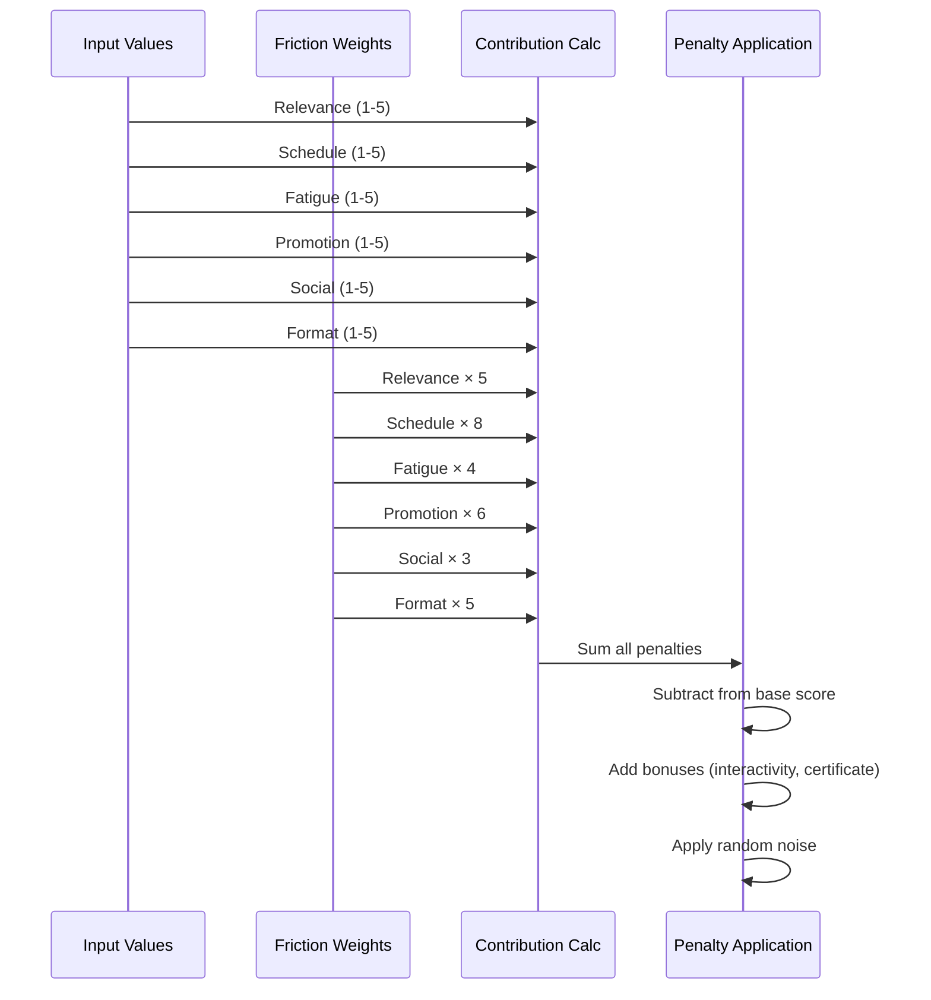

---

## 🔌 API Design

### Key Endpoints

| Endpoint | Method | Description |
|----------|--------|-------------|
| `/api/predict` | POST | Get attendance prediction |
| `/api/stats/overview` | GET | Dashboard overview stats |
| `/api/stats/charts` | GET | Chart data for visualizations |
| `/api/events` | GET | List all events |
| `/api/models` | GET | List registered models |

### Prediction Request

```json
{
  "domain": "Tech",
  "eventType": "Workshop",
  "speakerType": "Industry",
  "durationHours": 2,
  "dayType": "Weekday",
  "timeSlot": "Afternoon",
  "promotionDays": 7,
  "certificateFlag": true,
  "interactivityLevel": 0.5,
  "frictions": {
    "promotion": 1,
    "fatigue": 1,
    "format": 1,
    "social": 1,
    "schedule": 1,
    "relevance": 1
  }
}
```

### Prediction Response

```json
{
  "predictedAttendance": 125,
  "category": "High",
  "confidenceInterval": [110, 140],
  "recommendations": [
    "Increase promotion days to improve turnout."
  ],
  "contributingFactors": [
    { "factor": "Promotion", "impact": "Negative", "weight": 7 },
    { "factor": "Speaker", "impact": "Positive", "weight": 25 },
    { "factor": "Interactivity", "impact": "Positive", "weight": 50 },
    { "factor": "Friction", "impact": "Negative", "weight": 0 }
  ]
}
```

---

## 🖥️ Local Setup

### Prerequisites

- **Node.js** (v18+)
- **npm** or **pnpm**
- **Python** 3.8+
- **pip**

### Installation Steps

#### 1. Install Python Dependencies

```bash
cd Event-Insights-Hub/python_api
pip install -r requirements.txt
```

#### 2. Start Python API

```bash
cd Event-Insights-Hub/python_api
python -m uvicorn app:app --host 127.0.0.1 --port 8001
```

#### 3. Install Node Dependencies

```bash
cd Event-Insights-Hub
npm install
```

#### 4. Run Development Server

```bash
cd Event-Insights-Hub
npm run dev
```

#### 5. Open Application

Navigate to:
```
http://localhost:5000
```

### Environment Variables (Optional)

Create `.env` file in `Event-Insights-Hub/`:

```env
PORT=5000
PYTHON_MODEL_URL=http://127.0.0.1:8001
```

---

## 💾 Model Versioning & Lifecycle

### Versioning Strategy

Each training run:

1. Automatically increments model version
2. Stores model in `artifacts/model_vX_timestamp/`
3. Updates `artifacts/latest_model.joblib`
4. Logs metadata in `artifacts/model_registry.json`

### Metadata Stored

```json
{
  "latest_version": 2,
  "models": [
    {
      "version": 1,
      "timestamp": "2026-02-08_19-41-56",
      "model_type": "LinearRegression",
      "metrics": {
        "rmse": 14.76,
        "mae": 12.22,
        "r2": 0.76
      },
      "path": "artifacts/model_v1_2026-02-08_19-41-56"
    }
  ]
}
```

### Registry Viewer

```bash
cd checking_predicting
python list_models.py
```

---

## ⚠️ Limitations

### Data Limitations

- **Synthetic Data**: May not perfectly reflect real-world university patterns
- **Static Dataset**: No temporal trends or seasonal effects
- **Limited Scope**: Only 5 domains and 3 event types

### Model Limitations

- **Linear Assumptions**: Complex interactions may not be fully captured
- **Static Predictions**: No learning from new predictions over time
- **Uncertainty**: Predictions have inherent variance (±15 range)

### System Constraints

| Category | Limitation | Impact |
|----------|-----------|--------|
| **Data** | Synthetic only | May not generalize to real institutions |
| **Model** | Linear assumptions | Complex patterns not captured |
| **Integration** | Local Python API | Requires separate process |
| **Scale** | Single user | Not designed for concurrent heavy usage |

---

## 🚀 Future Improvements

### Roadmap

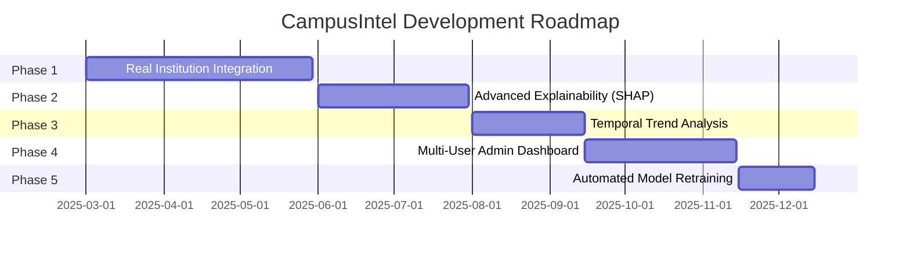

### Planned Features

#### 1. Real Institutional Integration

- CSV upload for real event data
- Database migration tools
- Custom domain configuration

#### 2. Advanced Explainability

- **SHAP (SHapley Additive exPlanations)** for feature importance
- **Partial Dependence Plots** for feature effects
- **Feature Interaction Analysis**

#### 3. Temporal Analysis

- Track attendance trends over time
- Seasonal effect detection
- Event lifecycle analytics

#### 4. Admin Analytics Dashboard

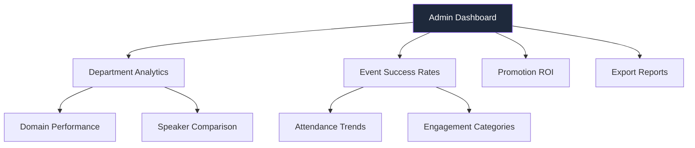

#### 5. Automated Retraining

- Scheduled model retraining
- Performance monitoring
- A/B testing framework

---

## 📄 License

This project is developed for **academic purposes only**.

**Restrictions:**
- ❌ Not for commercial use without permission
- ❌ Not for production deployment without validation
- ✅ Educational use permitted
- ✅ Research purposes permitted

---

## 🤝 Contributing

Contributions are welcome for academic improvement purposes.

### How to Contribute

1. Fork the repository
2. Create a feature branch (`git checkout -b feature/improvement`)
3. Commit changes (`git commit -m 'Add improvement'`)
4. Push to branch (`git push origin feature/improvement`)
5. Open a Pull Request

---

## 📧 Contact

For academic inquiries or collaboration:

- **Project Maintainer**: Rajdeep
- **Institution**: Vijaybhoomi University
- **Email**: rajgupta6320@gmail.com

---

## 🙏 Acknowledgments

- **scikit-learn** for machine learning tools
- **FastAPI** for Python API framework
- **React** and **TypeScript** for frontend framework
- **Recharts** for visualization library
- **shadcn/ui** for UI components
- **SQLite** for lightweight database
- Academic advisors and reviewers

---

<div align="center">

**🎓 Empowering Data-Driven Event Planning in Higher Education 🎓**

---

Made with 💙 for campus engagement research

</div>
