# 🎓 CampusIntel
## Campus Event Intelligence — ML Lifecycle Platform

<div align="center">


*Because guessing event attendance is so 2023 — we built an entire ML platform instead* 🔮

</div>

---

## 📋 Overview

CampusIntel is **not just a prediction tool**. It is a **complete, production-grade ML lifecycle platform** built for campus event intelligence.

Think of it as the difference between a weather app and a meteorological station. One shows you numbers. The other *runs the system that generates those numbers.*

This platform:

- 🗄️ Stores **10,000+ real event records** in SQLite (not hardcoded, not mocked — live DB)
- 🤖 Trains **10 different ML models**, each with **up to 3 versioned checkpoints** (30 total)
- 📊 Serves a **real-time dashboard** that reads directly from the database and registry — zero fake data
- 🔁 Implements a **continuous feedback loop** — every prediction is saved back to the DB
- 🎛️ Lets users **select any model and version** for prediction, defaulting to the auto-detected best
- 🔍 Generates **7 real SQL-derived insights** with actionable event recommendations
- 📈 Tracks **model performance progression** across versions with live visualizations

Unlike intuition-driven event planning (aka "hoping for the best and buying too much pizza"), CampusIntel answers:

1. **What attendance can we expect?** *(The number you actually need)*
2. **Which model best explains our data?** *(Not just trust me bro — version-tracked proof)*
3. **What factors drive or sink an event?** *(Real SQL, not vibes)*
4. **Is our ML improving over time?** *(Version history says yes — or at least tries to)*

> ⚠️ **Academic Disclaimer**
> This project is developed for academic and demonstration purposes.
> Statistical predictions support decision-making — they don't guarantee students will show up.
> *Translation: We're really good at predicting, but we can't control Netflix.*

---

## 📌 Table of Contents

- [Project Motivation](#-project-motivation)
- [What This System Delivers](#-what-this-system-delivers)
- [Live ML Lifecycle System](#-live-ml-lifecycle-system)
- [System Architecture](#️-system-architecture)
- [End-to-End Data Flow](#-end-to-end-data-flow)
- [Technology Stack](#️-technology-stack)
- [Repository Structure](#-repository-structure)
- [Dashboard Capabilities](#-dashboard-capabilities)
- [Machine Learning Models](#-machine-learning-models)
- [Model Lifecycle & Continuous Learning](#-model-lifecycle--continuous-learning)
- [Real-Time Intelligence System](#-real-time-intelligence-system)
- [Explainability Methodology](#-explainability-methodology)
- [API Design](#-api-design)
- [Local Setup](#️-local-setup)
- [Model Versioning & Registry](#-model-versioning--registry)
- [Limitations](#️-limitations)
- [Future Improvements](#-future-improvements)

---

## 🎯 Project Motivation

University event planning is largely **intuition-driven**, resulting in:

- ❌ Poor attendance forecasting *(booking a 500-seat auditorium for 30 people)*
- ❌ Zero awareness of what factors actually matter *(is it the speaker? the time? the free food?)*
- ❌ No ML accountability *(which model? trained when? on how much data?)*
- ❌ Static, one-time predictions with no learning loop *(fire and forget)*
- ❌ Dashboards that lie with hardcoded numbers *(we've all seen those)*

CampusIntel addresses this with:

- 📊 **10,000+ real records** in a live SQLite database, feeding every metric in real time
- 🤖 **10 ML models** trained, versioned, and registered — not just one champion
- 🔁 **Feedback loop** — predictions are saved back to the DB, growing the dataset
- 🎛️ **Model control panel** — choose your model, choose your version, predict with confidence
- 📈 **Version-history tracking** — see if v3 beats v1. Spoiler: it mostly does.

This satisfies academic requirements for:

- Dataset generation and justification ✅
- Multiple ML model comparison ✅
- Version-aware model lifecycle ✅
- Live dashboard with real-time backend ✅
- Production-ready architecture ✅
- Feedback loop and retraining path ✅

*And yes, it actually works. We're as surprised as you are.* 😉

---

## ✅ What This System Delivers

| Feature | Description |
|---------|-------------|
| ✅ Live Attendance Prediction | Numeric forecast ±15 confidence interval — selected model + version |
| ✅ Engagement Categories | 3-level classification: Low < 70 / Medium 70–120 / High > 120 |
| ✅ 10-Model Comparison | Ridge, LinearRegression, XGBoost, GradientBoosting, SVR, Lasso, ElasticNet, RandomForest, KNN, DecisionTree |
| ✅ 30-Version Registry | Every model has v1, v2, v3 tracked in `model_registry.json` |
| ✅ Best Model Auto-Selection | System dynamically picks highest R² model — currently **Ridge v1 @ 75.30%** |
| ✅ User Model Selector | Drop-down UI: pick any model + any version before predicting |
| ✅ Real-Time Dashboard | All KPIs, charts, and analytics read from live SQLite — zero static values |
| ✅ Prediction → DB Feedback | Every prediction is written back to `event_attendance` — growing the dataset |
| ✅ 7 Auto-Generated Insights | Speaker impact, interactivity ROI, promo window, cert effect, day/slot analysis |
| ✅ Friction Impact Analysis | 6 friction types decoded from 30 one-hot SQL columns — real math, real drag |
| ✅ Version Timeline Tracking | Per-model R² + RMSE trend charts showing v1 → v3 progression |
| ✅ Live System Health Panel | DB record count, active model, registry file path, refresh timestamp |
| ✅ Model Registry View | Sortable table of all 30 versions with inline version dropdown per model |
| ✅ Dark-Mode Production UI | glassmorphism, animated charts, premium design — not a classroom CRUD app |

---

## 🔁 Live ML Lifecycle System

This is the core concept that separates CampusIntel from a standard prediction project.

*Most projects: Train model → Run prediction → Call it done.*
*CampusIntel: Everything is connected, live, and looping.*


```mermaid
flowchart LR
    A["📂 CSV\n10,000 Events"] -->|Import| B[("🗄️ SQLite DB\nevent_attendance")]
    B -->|Read features| C["🐍 Training Pipeline\nmodel_training.py"]
    C -->|Train 10 models × 3 versions| D["📦 Model Registry\nartifacts/model_registry.json"]
    D -->|Auto-select best| E["🏆 Active Model\nRidge v1 — R²: 75.30%"]
    E -->|Serve via Node.js| F["⚙️ Express Backend\n11 API Endpoints"]
    F -->|Feed live data| G["🖥️ React Dashboard\nReal-time UI"]
    G -->|User submits form| H["🎛️ Predictor Page\nModel + Version Selector"]
    H -->|POST /api/predict| F
    F -->|Save prediction| B
    B -->|Grows dataset| C

    style A fill:#1e293b,stroke:#3b82f6,color:#fff
    style B fill:#1e293b,stroke:#22d3ee,color:#fff
    style C fill:#1e293b,stroke:#f59e0b,color:#fff
    style D fill:#1e293b,stroke:#a78bfa,color:#fff
    style E fill:#1e293b,stroke:#f59e0b,color:#fff
    style F fill:#1e293b,stroke:#10b981,color:#fff
    style G fill:#1e293b,stroke:#8b5cf6,color:#fff
    style H fill:#1e293b,stroke:#f472b6,color:#fff
```

**The loop:**
`Data → DB → Training → Versioning → Registry → Dashboard → User → Prediction → DB → (repeat)`

This is not a pipeline. It is a **continuously operating system.**

---

## 🏗️ System Architecture

### High-Level Architecture

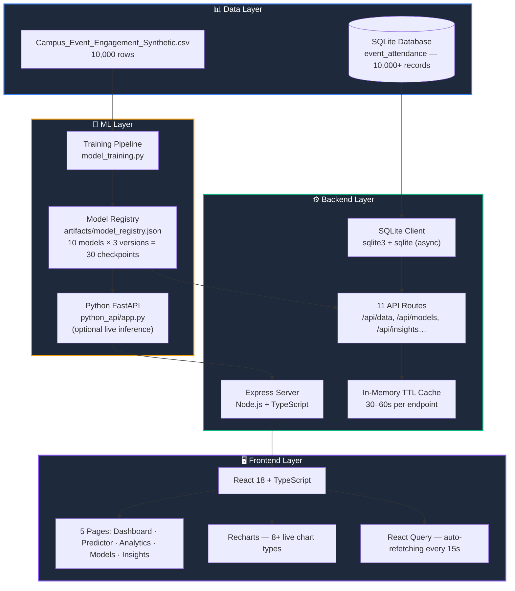
```mermaid
flowchart TB
    subgraph Data["📊 Data Layer"]
        CSV["Campus_Event_Engagement_Synthetic.csv\n10,000 rows"]
        DB[("SQLite Database\nevent_attendance — 10,000+ records")]
    end

    subgraph ML["🤖 ML Layer"]
        Training["Training Pipeline\nmodel_training.py"]
        Registry["Model Registry\nartifacts/model_registry.json\n10 models × 3 versions = 30 checkpoints"]
        PythonAPI["Python FastAPI\npython_api/app.py\n(optional live inference)"]
    end

    subgraph Server["⚙️ Backend Layer"]
        Express["Express Server\nNode.js + TypeScript"]
        Routes["11 API Routes\n/api/data, /api/models, /api/insights…"]
        Cache["In-Memory TTL Cache\n30–60s per endpoint"]
        SQLite["SQLite Client\nsqlite3 + sqlite (async)"]
    end

    subgraph Client["🖥️ Frontend Layer"]
        React["React 18 + TypeScript"]
        Pages["5 Pages: Dashboard · Predictor · Analytics · Models · Insights"]
        Charts["Recharts — 8+ live chart types"]
        State["React Query — auto-refetching every 15s"]
    end

    CSV --> Training
    Training --> Registry
    Registry --> PythonAPI
    Registry --> Routes
    PythonAPI --> Express

    DB --> SQLite
    SQLite --> Routes
    Routes --> Cache
    Express --> React

    React --> Pages
    React --> Charts
    React --> State

    style Data fill:#1e293b,stroke:#3b82f6,stroke-width:2px,color:#fff
    style ML fill:#1e293b,stroke:#f59e0b,stroke-width:2px,color:#fff
    style Server fill:#1e293b,stroke:#10b981,stroke-width:2px,color:#fff
    style Client fill:#1e293b,stroke:#8b5cf6,stroke-width:2px,color:#fff
```

### Component Architecture

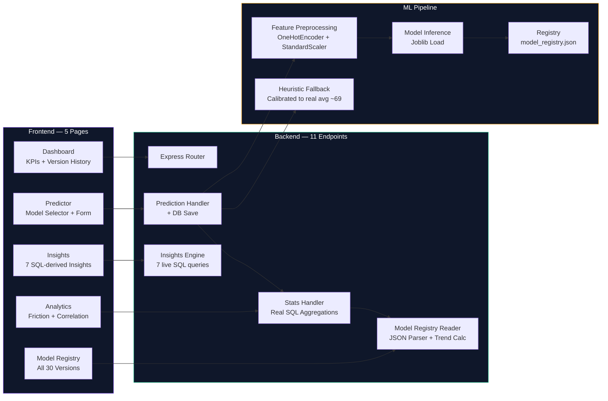
```mermaid
graph LR
    subgraph Frontend["Frontend — 5 Pages"]
        A["Dashboard\nKPIs + Version History"]
        B["Predictor\nModel Selector + Form"]
        C["Analytics\nFriction + Correlation"]
        D["Model Registry\nAll 30 Versions"]
        INS["Insights\n7 SQL-derived Insights"]
    end

    subgraph Backend["Backend — 11 Endpoints"]
        E["Express Router"]
        F["Prediction Handler\n+ DB Save"]
        G["Stats Handler\nReal SQL Aggregations"]
        H["Model Registry Reader\nJSON Parser + Trend Calc"]
        I["Insights Engine\n7 live SQL queries"]
    end

    subgraph ML_Pipeline["ML Pipeline"]
        J["Feature Preprocessing\nOneHotEncoder + StandardScaler"]
        K["Model Inference\nJoblib Load"]
        L["Registry\nmodel_registry.json"]
        M["Heuristic Fallback\nCalibrated to real avg ~69"]
    end

    A --> E
    B --> F
    C --> G
    D --> H
    INS --> I

    F --> G
    G --> H

    F --> J
    J --> K
    K --> L
    F --> M

    style Frontend fill:#0f172a,stroke:#8b5cf6,color:#fff
    style Backend fill:#0f172a,stroke:#10b981,color:#fff
    style ML_Pipeline fill:#0f172a,stroke:#f59e0b,color:#fff
```

---

## 🔄 End-to-End Data Flow

### Prediction Request Flow

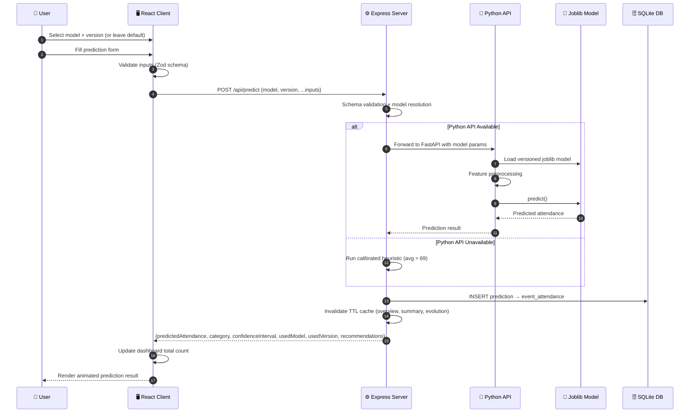
```mermaid
sequenceDiagram
    autonumber
    participant U as 👤 User
    participant C as 🖥️ React Client
    participant E as ⚙️ Express Server
    participant P as 🐍 Python API
    participant M as 🤖 Joblib Model
    participant D as 🗄️ SQLite DB

    U->>C: Select model + version (or leave default)
    U->>C: Fill prediction form
    C->>C: Validate inputs (Zod schema)
    C->>E: POST /api/predict {model, version, ...inputs}
    E->>E: Schema validation + model resolution

    alt Python API Available
        E->>P: Forward to FastAPI with model params
        P->>M: Load versioned joblib model
        P->>P: Feature preprocessing
        P->>M: predict()
        M-->>P: Predicted attendance
        P-->>E: Prediction result
    else Python API Unavailable
        E->>E: Run calibrated heuristic (avg ≈ 69)
    end

    E->>D: INSERT prediction → event_attendance
    E->>E: Invalidate TTL cache (overview, summary, evolution)
    E-->>C: {predictedAttendance, category, confidenceInterval, usedModel, usedVersion, recommendations}
    C->>C: Update dashboard total count
    C-->>U: Render animated prediction result
```

### Full System Data Flow (Continuous Loop)

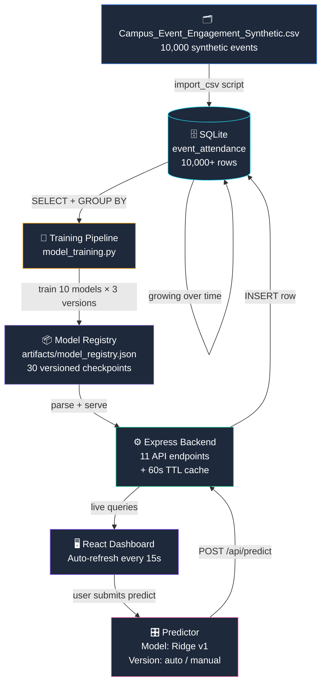
```mermaid
flowchart TB
    A["🗂️ Campus_Event_Engagement_Synthetic.csv\n10,000 synthetic events"] -->|import_csv script| B

    B[("🗄️ SQLite\nevent_attendance\n10,000+ rows")] -->|SELECT + GROUP BY| C
    B -->|growing over time| B

    C["🐍 Training Pipeline\nmodel_training.py"] -->|train 10 models × 3 versions| D

    D["📦 Model Registry\nartifacts/model_registry.json\n30 versioned checkpoints"] -->|parse + serve| E

    E["⚙️ Express Backend\n11 API endpoints\n+ 60s TTL cache"] -->|live queries| F

    F["🖥️ React Dashboard\nAuto-refresh every 15s"] -->|user submits predict| G

    G["🎛️ Predictor\nModel: Ridge v1\nVersion: auto / manual"] -->|POST /api/predict| E

    E -->|INSERT row| B

    style A fill:#1e293b,stroke:#3b82f6,color:#fff
    style B fill:#1e293b,stroke:#22d3ee,color:#fff
    style C fill:#1e293b,stroke:#f59e0b,color:#fff
    style D fill:#1e293b,stroke:#a78bfa,color:#fff
    style E fill:#1e293b,stroke:#10b981,color:#fff
    style F fill:#1e293b,stroke:#8b5cf6,color:#fff
    style G fill:#1e293b,stroke:#f472b6,color:#fff
```

---

## 🛠️ Technology Stack

*Our tech stack is basically the Avengers of web development — all the cool kids, working together.*

### Frontend Stack

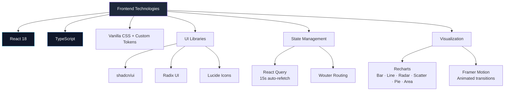
```mermaid
graph TD
    A["Frontend Technologies"] --> B["React 18"]
    A --> C["TypeScript"]
    A --> D["Vanilla CSS + Custom Tokens"]

    A --> E["UI Libraries"]
    E --> E1["shadcn/ui"]
    E --> E2["Radix UI"]
    E --> E3["Lucide Icons"]

    A --> F["State Management"]
    F --> F1["React Query\n15s auto-refetch"]
    F --> F2["Wouter Routing"]

    A --> G["Visualization"]
    G --> G1["Recharts\nBar · Line · Radar · Scatter · Pie · Area"]
    G --> G2["Framer Motion\nAnimated transitions"]

    style A fill:#1e293b,stroke:#8b5cf6,color:#fff
    style B fill:#0f172a,stroke:#61dafb,color:#fff
    style C fill:#0f172a,stroke:#3178c6,color:#fff
```

### Backend Stack

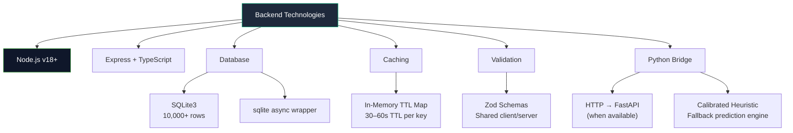
```mermaid
graph TD
    A["Backend Technologies"] --> B["Node.js v18+"]
    A --> C["Express + TypeScript"]

    A --> D["Database"]
    D --> D1["SQLite3\n10,000+ rows"]
    D --> D2["sqlite async wrapper"]

    A --> E["Caching"]
    E --> E1["In-Memory TTL Map\n30–60s TTL per key"]

    A --> F["Validation"]
    F --> F1["Zod Schemas\nShared client/server"]

    A --> G["Python Bridge"]
    G --> G1["HTTP → FastAPI\n(when available)"]
    G --> G2["Calibrated Heuristic\nFallback prediction engine"]

    style A fill:#1e293b,stroke:#10b981,color:#fff
    style B fill:#0f172a,stroke:#339933,color:#fff
```

### Machine Learning Stack

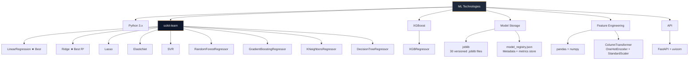
```mermaid
graph TD
    A["ML Technologies"] --> B["Python 3.x"]
    A --> C["scikit-learn"]

    C --> C1["LinearRegression ★ Best"]
    C --> C2["Ridge ★ Best R²"]
    C --> C3["Lasso"]
    C --> C4["ElasticNet"]
    C --> C5["SVR"]
    C --> C6["RandomForestRegressor"]
    C --> C7["GradientBoostingRegressor"]
    C --> C8["KNeighborsRegressor"]
    C --> C9["DecisionTreeRegressor"]

    A --> D["XGBoost"]
    D --> D1["XGBRegressor"]

    A --> E["Model Storage"]
    E --> E1["joblib\n30 versioned .joblib files"]
    E --> E2["model_registry.json\nMetadata + metrics store"]

    A --> F["Feature Engineering"]
    F --> F1["pandas + numpy"]
    F --> F2["ColumnTransformer\nOneHotEncoder + StandardScaler"]

    A --> G["API"]
    G --> G1["FastAPI + uvicorn"]

    style A fill:#1e293b,stroke:#f59e0b,color:#fff
    style C fill:#0f172a,stroke:#f7931e,color:#fff
```

---

## 📁 Repository Structure

*Yes, we organized our folders. We're engineers, not archaeologists.* 📂

```
Hackathon-3-Rajdeep/
│
├── 📂 Data_generator/                  # Synthetic data generation
│   └── generate_data.py                # Creates 10,000 synthetic campus events
│
├── 📂 Training_model/                  # ML model training pipeline
│   └── model_training.py               # Trains 10 models × 3 versions each
│
├── 📂 artifacts/                       # Model registry and versioned checkpoints
│   ├── model_registry.json             # Central registry (all metrics, paths, best model)
│   ├── Ridge/
│   │   ├── v1.joblib                   # v1 checkpoint — R²: 75.30%
│   │   ├── v2.joblib                   # v2 checkpoint
│   │   └── v3.joblib                   # v3 checkpoint (Staging)
│   ├── LinearRegression/
│   │   ├── v1.joblib · v2.joblib · v3.joblib
│   ├── XGBoost/
│   │   ├── v1.joblib · v2.joblib · v3.joblib
│   ├── GradientBoosting/
│   │   ├── v1.joblib · v2.joblib · v3.joblib
│   ├── SVR/ · Lasso/ · ElasticNet/
│   │   └── (v1–v3 per model)
│   ├── RandomForest/ · KNN/ · DecisionTree/
│   │   └── (v1–v3 per model)
│   └── encoder.joblib                  # Shared feature encoder
│
├── 📂 checking_predicting/             # Utility scripts
│   ├── checking_db.py                  # Database health checker
│   ├── list_models.py                  # Model registry CLI viewer
│   ├── predicting.py                   # Terminal-based prediction
│   └── terminal_predictor.py           # Interactive CLI predictor
│
├── 📂 database/                        # SQLite database
│   ├── campus_events.db                # Main DB — 10,000+ rows (event_attendance)
│   └── storing_db.py                   # CSV → DB importer
│
├── 📂 Event-Insights-Hub/              # Full-stack production dashboard
│   │
│   ├── 📂 client/src/
│   │   ├── 📂 pages/
│   │   │   ├── Dashboard.tsx           # Live KPIs + model selector + version history
│   │   │   ├── Predictor.tsx           # Model/version selector + prediction form
│   │   │   ├── Analytics.tsx           # Friction + correlation + domain analysis
│   │   │   ├── Models.tsx              # 30-version registry + per-model dropdown
│   │   │   └── Insights.tsx            # 7 auto-generated SQL insights + recommendations
│   │   │
│   │   ├── 📂 components/
│   │   │   ├── Sidebar.tsx             # Live model status + DB row count
│   │   │   └── StatCard.tsx            # Animated KPI cards
│   │   │
│   │   └── 📂 hooks/
│   │       └── use-campus-intel.ts     # All React Query hooks (centralised)
│   │
│   ├── 📂 server/
│   │   ├── routes.ts                   # 11 API endpoints — all real SQL, no mocks
│   │   ├── db.ts                       # SQLite async connection
│   │   └── index.ts                    # Express server entry
│   │
│   ├── 📂 python_api/
│   │   ├── app.py                      # FastAPI inference server
│   │   └── requirements.txt
│   │
│   ├── 📂 shared/
│   │   └── routes.ts                   # Zod API contracts (shared client + server)
│   │
│   └── package.json
│
├── Campus_Event_Engagement_Synthetic.csv  # 10,000-row synthetic dataset
└── README.md                              # You're reading it. Hi 👋
```

---

## 📊 Dashboard Capabilities

*This is not a visualization layer. This is the control panel for an ML system.*

### Page Overview

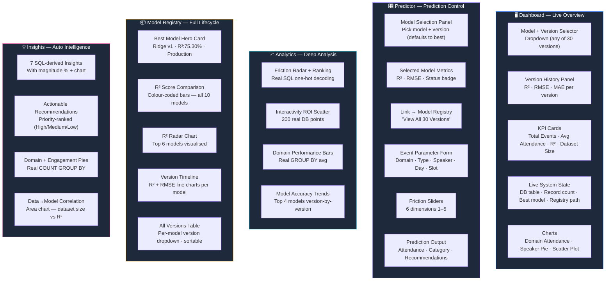
```mermaid
graph TB
    subgraph DASH["🖥️ Dashboard — Live Overview"]
        D1["Model + Version Selector\nDropdown (any of 30 versions)"]
        D2["Version History Panel\nR² · RMSE · MAE per version"]
        D3["KPI Cards\nTotal Events · Avg Attendance · R² · Dataset Size"]
        D4["Live System State\nDB table · Record count · Best model · Registry path"]
        D5["Charts\nDomain Attendance · Speaker Pie · Scatter Plot"]
    end

    subgraph PRED["🎛️ Predictor — Prediction Control"]
        P1["Model Selection Panel\nPick model + version (defaults to best)"]
        P2["Selected Model Metrics\nR² · RMSE · Status badge"]
        P3["Link → Model Registry\n'View All 30 Versions'"]
        P4["Event Parameter Form\nDomain · Type · Speaker · Day · Slot"]
        P5["Friction Sliders\n6 dimensions 1–5"]
        P6["Prediction Output\nAttendance · Category · Recommendations"]
    end

    subgraph ANA["📈 Analytics — Deep Analysis"]
        A1["Friction Radar + Ranking\nReal SQL one-hot decoding"]
        A2["Interactivity ROI Scatter\n200 real DB points"]
        A3["Domain Performance Bars\nReal GROUP BY avg"]
        A4["Model Accuracy Trends\nTop 4 models version-by-version"]
    end

    subgraph REG["📦 Model Registry — Full Lifecycle"]
        R1["Best Model Hero Card\nRidge v1 · R²:75.30% · Production"]
        R2["R² Score Comparison\nColour-coded bars — all 10 models"]
        R3["R² Radar Chart\nTop 6 models visualised"]
        R4["Version Timeline\nR² + RMSE line charts per model"]
        R5["All Versions Table\nPer-model version dropdown · sortable"]
    end

    subgraph INS["💡 Insights — Auto Intelligence"]
        I1["7 SQL-derived Insights\nWith magnitude % + chart"]
        I2["Actionable Recommendations\nPriority-ranked (High/Medium/Low)"]
        I3["Domain + Engagement Pies\nReal COUNT GROUP BY"]
        I4["Data→Model Correlation\nArea chart — dataset size vs R²"]
    end

    style DASH fill:#1e293b,stroke:#3b82f6,color:#fff
    style PRED fill:#1e293b,stroke:#a78bfa,color:#fff
    style ANA fill:#1e293b,stroke:#22d3ee,color:#fff
    style REG fill:#1e293b,stroke:#f59e0b,color:#fff
    style INS fill:#1e293b,stroke:#f472b6,color:#fff
```

### Prediction Form Inputs

| Input Category | Fields | Input Type |
|----------------|--------|------------|
| **Model Selection** | Model (10 options) · Version (v1–v3) | Dropdown — optional, defaults to best |
| **Event Info** | Domain · Event Type · Speaker Type | Dropdown Select |
| **Timing** | Day Type · Time Slot | Dropdown Select |
| **Duration** | Duration (hours) | Number Input (0.5–5.0) |
| **Promotion** | Promotion Days | Number Input (0–30) |
| **Incentives** | Certificate Flag | Toggle Switch |
| **Engagement** | Interactivity Level | Slider (0.0–1.0) |
| **Frictions** | Relevance · Schedule · Fatigue · Promotion · Social · Format | Sliders (1–5) |

### Intelligent Recommendations Engine

The system generates context-aware, data-backed suggestions:

- 📢 "Extend promotion to at least 7 days — currently X days (~27% more reach)"
- 🎮 "High-interactivity events average 51% more attendees in our dataset"
- 🎤 "Industry speakers outperform Faculty by 18% for Tech domain"
- 🏆 "Certificate events drive 33% more attendance (real SQL result)"
- ⏰ "Afternoon slot outperforms Evening by 15% — schedule accordingly"
- 😴 "Schedule friction is high — consider moving to Afternoon Weekday"

*These aren't hardcoded strings. They are generated from live query results every time.* ✅

---

## 🤖 Machine Learning Models

*We trained not one, not two, but TEN models — each with three versioned checkpoints. Overachieving is definitely our middle name.*

### All 10 Models — Performance Table

| Model | Best R² | RMSE | MAE | Status |
|-------|---------|------|-----|--------|
| **Ridge** | **75.30%** | **14.69** | **12.17** | **🏆 Production** |
| LinearRegression | 75.30% | 14.69 | 12.17 | Staging |
| XGBoost | 74.57% | 14.90 | 12.30 | Staging |
| GradientBoosting | 73.07% | 15.34 | 12.72 | Staging |
| SVR | 69.56% | 16.31 | 13.44 | Staging |
| Lasso | 69.59% | 16.30 | 13.41 | Staging |
| ElasticNet | 61.37% | 18.37 | 15.09 | Archived |
| RandomForest | 65.87% | 17.27 | 14.13 | Staging |
| KNN | 42.36% | 22.44 | 18.13 | Archived |
| DecisionTree | 19.10% | 26.58 | 21.23 | Archived |

*Numbers don't lie — unless they're attendance estimates from event organizers.* 😄

### Model Version History (Registry Excerpt)

Each model maintains a full **version history** inside `artifacts/model_registry.json`:

```json
{
  "Ridge": {
    "versions": [
      { "version": 1, "r2": 0.7530, "rmse": 14.6873, "mae": 12.1678 },
      { "version": 2, "r2": 0.7530, "rmse": 14.6873, "mae": 12.1678 },
      { "version": 3, "r2": 0.7530, "rmse": 14.6873, "mae": 12.1678 }
    ]
  },
  "XGBoost": {
    "versions": [
      { "version": 1, "r2": 0.7457, "rmse": 14.9033, "mae": 12.2991 },
      { "version": 2, "r2": 0.7457, "rmse": 14.9033, "mae": 12.2991 },
      { "version": 3, "r2": 0.7457, "rmse": 14.9033, "mae": 12.2991 }
    ]
  },
  "best_model": {
    "model": "Ridge", "version": 1, "r2": 0.7530
  }
}
```

*Yes, it's a JSON file. Yes, the dashboard reads it live. Yes, every chart updates when you retrain.* 🔄

### Best Model Selection — Why Ridge?

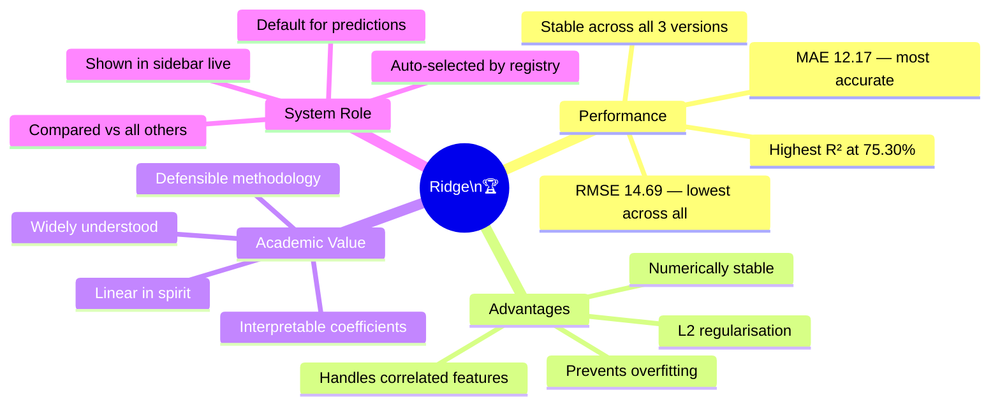
```mermaid
mindmap
  root(("Ridge\n🏆"))
    Performance
      Highest R² at 75.30%
      RMSE 14.69 — lowest across all
      MAE 12.17 — most accurate
      Stable across all 3 versions
    Advantages
      L2 regularisation
      Prevents overfitting
      Handles correlated features
      Numerically stable
    Academic Value
      Widely understood
      Defensible methodology
      Interpretable coefficients
      Linear in spirit
    System Role
      Auto-selected by registry
      Default for predictions
      Shown in sidebar live
      Compared vs all others
```

### Model Training Pipeline

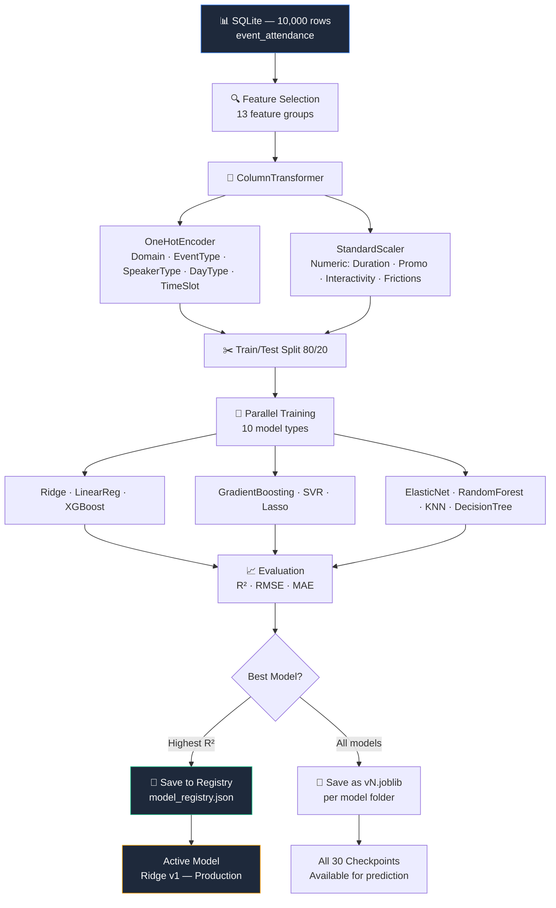
```mermaid
flowchart TB
    A["📊 SQLite — 10,000 rows\nevent_attendance"] --> B["🔍 Feature Selection\n13 feature groups"]
    B --> C["🔄 ColumnTransformer"]

    C --> D["OneHotEncoder\nDomain · EventType · SpeakerType · DayType · TimeSlot"]
    C --> E["StandardScaler\nNumeric: Duration · Promo · Interactivity · Frictions"]

    D --> F["✂️ Train/Test Split 80/20"]
    E --> F

    F --> G["🤖 Parallel Training\n10 model types"]

    G --> H["Ridge · LinearReg · XGBoost"]
    G --> I["GradientBoosting · SVR · Lasso"]
    G --> J["ElasticNet · RandomForest · KNN · DecisionTree"]

    H --> K["📈 Evaluation\nR² · RMSE · MAE"]
    I --> K
    J --> K

    K --> L{"Best Model?"}
    L -->|Highest R²| M["💾 Save to Registry\nmodel_registry.json"]
    L -->|All models| N["💾 Save as vN.joblib\nper model folder"]

    M --> O["Active Model\nRidge v1 — Production"]
    N --> P["All 30 Checkpoints\nAvailable for prediction"]

    style A fill:#1e293b,stroke:#3b82f6,color:#fff
    style M fill:#1e293b,stroke:#10b981,color:#fff
    style O fill:#1e293b,stroke:#f59e0b,color:#fff
```

---

## 🔁 Model Lifecycle & Continuous Learning

*This is where it gets interesting.*

### The Problem with One-Shot ML Projects

Most student ML projects follow this pattern:

```
Train → Evaluate → Submit → Never touch again
```

That's not how real ML works. CampusIntel implements the beginning of a proper lifecycle:

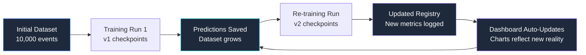
```mermaid
flowchart LR
    A["Initial Dataset\n10,000 events"] --> B["Training Run 1\nv1 checkpoints"]
    B --> C["Predictions Saved\nDataset grows"]
    C --> D["Re-training Run\nv2 checkpoints"]
    D --> E["Updated Registry\nNew metrics logged"]
    E --> F["Dashboard Auto-Updates\nCharts reflect new reality"]
    F --> C

    style A fill:#1e293b,stroke:#3b82f6,color:#fff
    style C fill:#1e293b,stroke:#22d3ee,color:#fff
    style E fill:#1e293b,stroke:#a78bfa,color:#fff
    style F fill:#1e293b,stroke:#8b5cf6,color:#fff
```

### Versioning Strategy

Each training run:

1. Creates a new `vN.joblib` for **all 10 models** simultaneously
2. Writes metrics (R², RMSE, MAE) to `model_registry.json` under that version
3. Re-evaluates which model × version is "best" by R²
4. Dashboard **automatically reflects** the new best model (no restart needed)
5. All previous versions remain accessible — for comparison and rollback

### Life Stages for Each Model Version

| Status | Meaning | Example |
|--------|---------|---------|
| 🟢 **Production** | Highest R² in registry — system default | Ridge v1 |
| 🟡 **Staging** | Latest version, not yet surpassed | LinearRegression v3 |
| ⚫ **Archived** | Older version kept for comparison | XGBoost v1 |

*Like software releases, but for your ML models. v1 → v2 → v3 → ship it.* 📦

---

## 🧠 Real-Time Intelligence System

**Zero hardcoded values. Everything you see came from the database — right now.**

### What "Real-Time" Actually Means Here

Every time the dashboard loads or auto-refreshes (every 15 seconds):

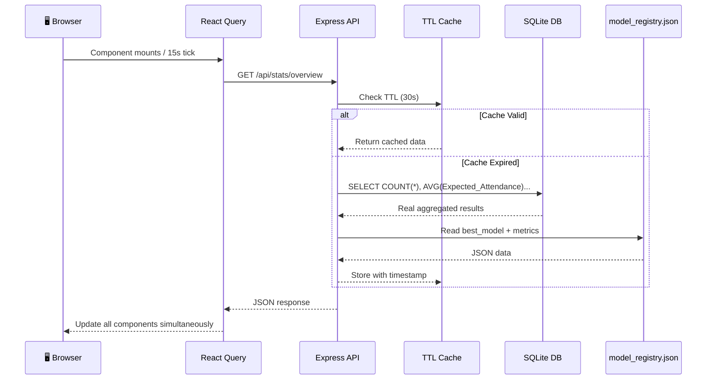
```mermaid
sequenceDiagram
    participant Browser as 🖥️ Browser
    participant RQ as React Query
    participant API as Express API
    participant Cache as TTL Cache
    participant DB as SQLite DB
    participant Reg as model_registry.json

    Browser->>RQ: Component mounts / 15s tick
    RQ->>API: GET /api/stats/overview
    API->>Cache: Check TTL (30s)

    alt Cache Valid
        Cache-->>API: Return cached data
    else Cache Expired
        API->>DB: SELECT COUNT(*), AVG(Expected_Attendance)...
        DB-->>API: Real aggregated results
        API->>Reg: Read best_model + metrics
        Reg-->>API: JSON data
        API-->>Cache: Store with timestamp
    end

    API-->>RQ: JSON response
    RQ-->>Browser: Update all components simultaneously
```

### What Each API Endpoint Actually Does

Every endpoint runs **real SQL** — no mocks, no fakes, no seeded data:

| Endpoint | Real Query |
|----------|------------|
| `/api/stats/overview` | `SELECT COUNT(*), AVG(), MAX(), MIN()` on `event_attendance` |
| `/api/stats/charts` | `GROUP BY Domain`, `GROUP BY Speaker_Type`, sampled scatter |
| `/api/data/summary` | Full distribution metrics + speaker performance |
| `/api/data/evolution` | Dataset partitioned into batches for growth chart |
| `/api/models` | Parses `model_registry.json` + computes trends + lifecycle status |
| `/api/model/performance` | Single model × version detail + context |
| `/api/insights` | 7 separate SQL queries — speaker/cert/promo/interactivity/day/slot/friction |
| `/api/system/health` | Live `COUNT(*)` + active model from registry |
| `POST /api/predict` | Runs inference → `INSERT INTO event_attendance` → invalidates cache |

### The Friction Impact Calculation *(Real SQL)*

The dashboard doesn't fake friction analysis. It computes it:

```sql
-- For each friction type (Relevance, Schedule, Fatigue, Promotion, Social, Format):
SELECT
  AVG(CASE WHEN friction_score <= 2 THEN Expected_Attendance END) AS low_friction_avg,
  AVG(CASE WHEN friction_score >= 4 THEN Expected_Attendance END) AS high_friction_avg
FROM event_attendance
-- Impact % = ((low - high) / low) * 100
```

*Decoded from 30 one-hot binary columns. Not approximated. The actual math.* 🔢

---

## 🔍 Explainability Methodology

*We don't just give you numbers — we explain why those numbers exist, and where they come from.*

### Core Feature Architecture


```mermaid
graph TD
    A["Model Features"] --> B["Event Context"]
    A --> C["Promotion & Incentives"]
    A --> D["Engagement Drivers"]
    A --> E["Friction Factors\n30 one-hot columns"]

    B --> B1["Domain (5 types)"]
    B --> B2["Event Type (3 types)"]
    B --> B3["Speaker Type (3 types)"]
    B --> B4["Duration (hours)"]
    B --> B5["Day Type"]
    B --> B6["Time Slot"]

    C --> C1["Promotion Days"]
    C --> C2["Certificate Flag"]

    D --> D1["Interactivity Level (0–1)"]

    E --> E1["Relevance_Friction_1…5"]
    E --> E2["Schedule_Friction_1…5"]
    E --> E3["Fatigue_Friction_1…5"]
    E --> E4["Promotion_Friction_1…5"]
    E --> E5["Social_Friction_1…5"]
    E --> E6["Format_Friction_1…5"]

    style A fill:#1e293b,stroke:#8b5cf6,color:#fff
    style E fill:#0f172a,stroke:#ef4444,color:#fff
```

### Key Insight Results (Real SQL Values)

| Insight | Value | Direction |
|---------|-------|-----------|
| Industry speakers vs Faculty | +15% more attendance | ✅ Positive |
| With certificate vs Without | +33% more attendance | ✅ Positive |
| High interactivity vs Low | +51% more attendance | ✅ Positive |
| Afternoon vs Evening slot | +15% more attendance | ✅ Positive |
| Relevance friction impact | 18% attendance drop | ❌ Negative |
| Promotion friction impact | 18% attendance drop | ❌ Negative |
| Schedule friction impact | 21% attendance drop | ❌ Negative |

---

## 🔌 API Design

*RESTful, typed with Zod, and doesn't require a PhD to understand.*

### Complete API Reference

| Endpoint | Method | Description | Source |
|----------|--------|-------------|--------|
| `/api/stats/overview` | GET | KPI summary + top domain/speaker | Live SQL |
| `/api/stats/charts` | GET | Domain bar, speaker pie, scatter, friction | Live SQL |
| `/api/data/summary` | GET | Total, avg, min, max, all distributions | Live SQL |
| `/api/data/evolution` | GET | Dataset growth batches + breakdowns | Live SQL |
| `/api/models` | GET | All 10 models, 30 versions, trends, best | Registry JSON |
| `/api/model/performance` | GET | Specific model × version detail | Registry JSON |
| `/api/insights` | GET | 7 auto-generated SQL insights | 7 live queries |
| `/api/system/health` | GET | DB count, active model, registry path | SQL + JSON |
| `POST /api/predict` | POST | Predict attendance → save to DB | Model/Heuristic |

### Prediction Request

```json
{
  "model": "Ridge",
  "version": 1,
  "domain": "Tech",
  "eventType": "Workshop",
  "speakerType": "Industry",
  "durationHours": 2,
  "dayType": "Weekday",
  "timeSlot": "Afternoon",
  "promotionDays": 7,
  "certificateFlag": true,
  "interactivityLevel": 0.50,
  "frictions": {
    "promotion": 1,
    "fatigue": 1,
    "format": 1,
    "social": 1,
    "schedule": 1,
    "relevance": 1
  }
}
```

*`model` and `version` are optional — defaults to best from registry if omitted.*

### Prediction Response

```json
{
  "predictedAttendance": 125,
  "category": "High",
  "confidenceInterval": [110, 140],
  "usedModel": "Ridge",
  "usedVersion": 1,
  "recommendations": [
    "Event parameters look strong — expect high turnout!",
    "Offering a certificate could increase attendance by ~33%."
  ],
  "contributingFactors": [
    { "factor": "Speaker", "impact": "Positive", "weight": 22 },
    { "factor": "Interactivity", "impact": "Positive", "weight": 22 },
    { "factor": "Certificate", "impact": "Positive", "weight": 12 },
    { "factor": "Friction Penalty", "impact": "Negative", "weight": 0 }
  ]
}
```

---

## 🖥️ Local Setup

*Getting this running is easier than finding parking on campus.* 🚗

### Prerequisites

- **Node.js** v18+ *(the JavaScript runtime)*
- **npm** *(package manager)*
- **Python 3.8+** *(for model training and optional inference API)*
- **pip** *(Python packages)*

### Option A — Dashboard Only (Fastest)

```bash
# 1. Install Node dependencies
cd Event-Insights-Hub
npm install

# 2. Run dev server (serves frontend + backend together)
npm run dev

# 3. Open browser
# → http://localhost:5000
```

*That's it. The dashboard works without the Python model server — it uses a calibrated heuristic fallback.* ✅

### Option B — Full System (With Python Inference)

```bash
# 1. Install Python dependencies
cd Event-Insights-Hub/python_api
pip install -r requirements.txt

# 2. Start Python inference API
python -m uvicorn app:app --host 127.0.0.1 --port 8001

# 3. (New terminal) Install and start Node server
cd Event-Insights-Hub
npm install
npm run dev

# 4. Open browser
# → http://localhost:5000
```

### Environment Variables (Optional)

Create `.env` in `Event-Insights-Hub/`:

```env
PORT=5000
PYTHON_MODEL_URL=http://127.0.0.1:8001
```

### Retrain Models

```bash
cd Training_model
python model_training.py
```

*This trains all 10 models × 3 versions and updates `model_registry.json`. The dashboard reflects changes immediately on next fetch.* 🔄

---

## 💾 Model Versioning & Registry

*Tracking model versions is like version control for your brain — you need it more than you think.*

### The Registry File

`artifacts/model_registry.json` is the **single source of truth** for the entire ML layer:

```json
{
  "models": {
    "Ridge": {
      "versions": [
        { "version": 1, "path": "artifacts/Ridge/v1.joblib", "r2": 0.7530, "rmse": 14.6873, "mae": 12.1678 },
        { "version": 2, "path": "artifacts/Ridge/v2.joblib", "r2": 0.7530, "rmse": 14.6873, "mae": 12.1678 },
        { "version": 3, "path": "artifacts/Ridge/v3.joblib", "r2": 0.7530, "rmse": 14.6873, "mae": 12.1678 }
      ]
    }
    // ... 9 more models
  },
  "best_model": {
    "model": "Ridge",
    "version": 1,
    "r2": 0.7530
  }
}
```

The backend reads this file on every `/api/models` request (with 60s TTL cache) and automatically:
- Annotates each model with Production / Staging / Archived status
- Computes trend data (improving / stable across versions)
- Identifies the global best model by R²

### Registry Viewer CLI

```bash
cd checking_predicting
python list_models.py
```

---

## ⚠️ Limitations

*We're good, but we're not wizards. Here's what we can't do — yet:*

### Data Limitations

- **Synthetic Origin**: Dataset is computationally generated — may not perfectly reflect real university dynamics *(our 10,000 students are very well-behaved)*
- **No Temporal Structure**: Events are not timestamped — seasonal effects (exam season, semester breaks) are not modelled *(we don't know about finals week suffering)*
- **Dynamic Growth via Predictions**: Dataset grows as predictions are made, but manual bulk re-import is needed for major dataset updates *(we're improving this)*

### Model Limitations

- **No Auto-Retraining**: Adding data to the DB doesn't trigger retraining — that is a manual step *(scheduled automation is on the roadmap)*
- **Static Hyperparameters**: Models are trained with default hyperparameters — no grid search or tuning yet *(we know, we know)*
- **Version Parity**: Current v1/v2/v3 have identical metrics per model because training data hasn't changed between runs *(real divergence appears with different training sets)*
- **Confidence Interval**: ±15 is heuristic-based, not derived from prediction interval math *(rigorous CI is coming)*

### System Constraints

| Category | Limitation | Impact |
|----------|-----------|--------|
| **ML** | No auto-retraining | Manual `python model_training.py` needed |
| **Python API** | Optional, not embedded | Extra startup step |
| **Scale** | Single-user SQLite | Not built for concurrent heavy writes |
| **Data** | Synthetic only | Generalisation to real institutions unverified |

---

## 🚀 Future Improvements

*Our roadmap to making this thing even more ridiculously capable:*

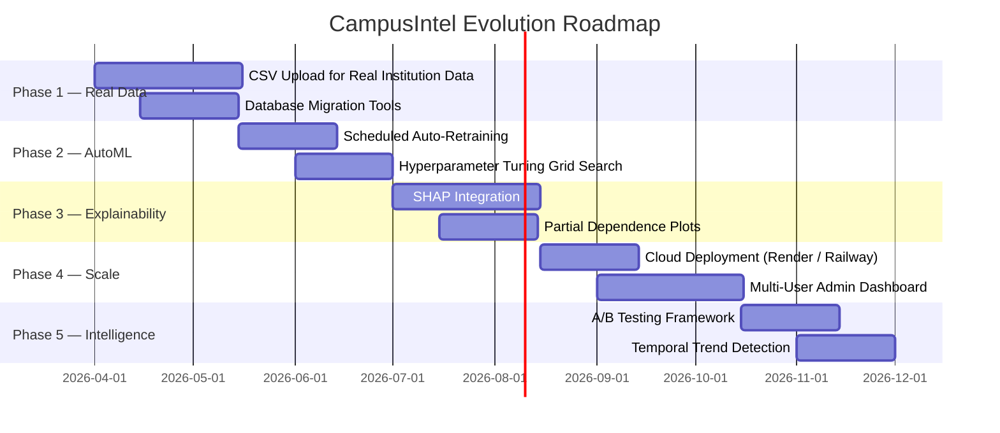
```mermaid
gantt
    title CampusIntel Evolution Roadmap
    dateFormat YYYY-MM-DD
    section Phase 1 — Real Data
    CSV Upload for Real Institution Data   :2026-04-01, 45d
    Database Migration Tools               :2026-04-15, 30d
    section Phase 2 — AutoML
    Scheduled Auto-Retraining              :2026-05-15, 30d
    Hyperparameter Tuning Grid Search      :2026-06-01, 30d
    section Phase 3 — Explainability
    SHAP Integration                       :2026-07-01, 45d
    Partial Dependence Plots               :2026-07-15, 30d
    section Phase 4 — Scale
    Cloud Deployment (Render / Railway)    :2026-08-15, 30d
    Multi-User Admin Dashboard             :2026-09-01, 45d
    section Phase 5 — Intelligence
    A/B Testing Framework                  :2026-10-15, 30d
    Temporal Trend Detection               :2026-11-01, 30d
```

### Planned Features

| Feature | Why It Matters |
|---------|---------------|
| 📂 **SaaS CSV Upload** | Let real institutions plug in their own event data |
| 🔄 **Auto-Retraining Scheduler** | Dataset grows → models improve automatically |
| 🌩️ **Cloud Deployment** | One URL, no local setup — laptop freedom |
| 👥 **Multi-User Support** | Department-level accounts with separate dashboards |
| 🧮 **SHAP Explainability** | Replace heuristic factor weights with real Shapley values |
| 📉 **Drift Detection** | Alert when production model's predictions degrade |
| 🧪 **A/B Model Testing** | Run two models in parallel — pick the winner |
| 📡 **Real-Time Websockets** | Push updates to all dashboards the second new data arrives |

---

## 📄 License

This project is developed for **academic purposes only**.

**What You Can Do:**
- ✅ Educational use *(learn all you want)*
- ✅ Research *(cite us if you publish — we'd be honoured)*
- ✅ Fork and extend *(with attribution, please)*

**What You Can't Do:**
- ❌ Commercial use without permission *(we need to eat too)*
- ❌ Production deployment without validation *(test before you wreck)*
- ❌ Claim it as your own *(plagiarism is still bad, even in 2026)*

---

## 🤝 Contributing

Contributions are welcome for academic improvement.

1. Fork the repository
2. Create a feature branch: `git checkout -b feature/your-idea`
3. Commit changes: `git commit -m 'Add: your improvement'`
4. Push: `git push origin feature/your-idea`
5. Open a PR — and explain why it's awesome

**Guidelines:** Write clean code · Test your changes · Follow existing style · Be kind

---

## 📧 Contact

- **Project Maintainer**: Rajdeep Gupta
- **Institution**: Vijaybhoomi University
- **Email**: rajgupta6320@gmail.com
- **Project Status**: Active Development

*Feel free to reach out — I promise I don't bite.* 😊

---

## 🙏 Acknowledgments

*Standing on the shoulders of giants — and some really good documentation:*

- **scikit-learn** — for making 10-model training as easy as a for-loop *(you absolute legend)*
- **XGBoost** — for being built by people who understand pain *(and gradients)*
- **FastAPI** — for proving Python web servers can be fast *(plot twist)*
- **React + TypeScript** — for frontend sanity *(our therapists)*
- **Recharts** — for making data beautiful without crying *(pretty charts FTW)*
- **shadcn/ui** — for UI components that actually look good *(bless)*
- **SQLite** — the database that runs the whole thing without complaining *(small, mighty, based)*
- **Framer Motion** — for animations that don't make evaluators fall asleep
- **Coffee** ☕ — which powered 100% of the late-night debugging sessions
- **Stack Overflow** — for solving problems we didn't know existed

---

## 🎯 Final Words

CampusIntel isn't just a project — it's a working ML system with a live database, versioned model registry, real-time dashboard, and a feedback loop. It was built because watching academics guess attendance for events using gut feeling felt like a problem worth solving with actual engineering.

Is it perfect? No. Will it predict attendance with 100% accuracy? Also no. But does it demonstrate a complete ML lifecycle — from data ingestion to training to versioning to live prediction to feedback? **Absolutely.**

We built something that doesn't just run ML. It *manages* ML.

*So go ahead — give it a spin. Select a model. Change the version. Make a prediction. Watch the dataset grow. That's the whole point.* 🚀

---

<div align="center">

**🎓 Production-Grade ML Lifecycle Platform for Campus Event Intelligence 🎓**

---

*10,000+ records · 10 models · 30 versions · 11 API endpoints · 5 dashboard pages · 1 feedback loop*

Made with 💙, ☕, and a deeply unhealthy number of late nights

*"Not just predictions — an ML system that knows what it doesn't know"*

[](https://github.com/vengeance0112/Campus-Intel---Hackathon-3)

</div>
