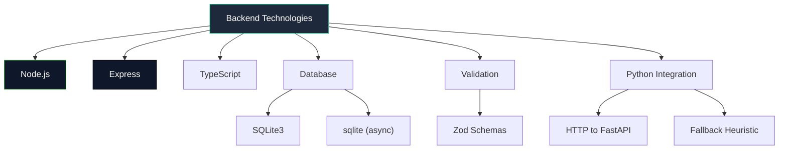

# 🎓 CampusIntel
## Campus Event Attendance Prediction & Engagement Intelligence Dashboard

<div align="center">


*Because guessing event attendance is so 2023* 🔮

</div>

---

## 📋 Overview

CampusIntel is a **full-stack, explainable machine learning dashboard** that predicts **expected attendance** for university events (**Low / Medium / High**) based on event characteristics, engagement factors, and friction indicators.

Think of it as your crystal ball for campus events—except this one actually works and won't charge you $50 for a tarot reading. 🎯

Unlike intuition-driven event planning (aka "hoping for the best"), this system focuses on **data-driven forecasting, interpretability, and actionable recommendations**, answering three core questions:

1. **What is the predicted attendance?** *(The number you actually care about)*
2. **Why is attendance predicted to be high or low?** *(Because "trust me bro" isn't a valid explanation)*
3. **What can be improved to boost engagement?** *(Spoiler: More pizza isn't always the answer)*

> ⚠️ **Academic Disclaimer**  
> This project is developed strictly for academic and demonstration purposes.  
> The system provides **statistical predictions** to support decision-making, not guaranteed attendance figures.  
> *Translation: We're really good at predicting, but we can't control if students decide to binge Netflix instead.*

---

## 📌 Table of Contents

- [Project Motivation](#project-motivation)
- [What This System Delivers](#what-this-system-delivers)
- [System Architecture](#system-architecture)
- [End-to-End Data Flow](#end-to-end-data-flow)
- [Technology Stack](#technology-stack)
- [Repository Structure](#repository-structure)
- [Dashboard Capabilities](#dashboard-capabilities)
- [Machine Learning Model](#machine-learning-model)
- [Explainability Methodology](#explainability-methodology)
- [API Design](#api-design)
- [Local Setup](#local-setup)
- [Model Versioning & Lifecycle](#model-versioning--lifecycle)
- [Limitations](#limitations)
- [Future Improvements](#future-improvements)

---

## 🎯 Project Motivation

University event planning is largely **intuition-driven**, resulting in:

- ❌ Poor attendance forecasting *(aka booking a 500-seat auditorium for 30 people)*
- ❌ Inefficient promotion strategies *(screaming into the void on Instagram)*
- ❌ Low student engagement *(crickets chirping)*
- ❌ Wasted logistical resources *(that catering bill still hurts)*

CampusIntel addresses this gap by:

- 📊 Learning from historical engagement patterns *(because data doesn't lie)*
- 🤖 Training **interpretable models (Linear Regression, SVR, Random Forest)** *(fancy words for smart math)*
- 🖥️ Deploying via a **professional dashboard interface** *(no more Excel spreadsheets, we promise)*
- 📈 Visually explaining *why* attendance is predicted to be high or low *(transparency is sexy)*

This project satisfies academic requirements for:

- Dataset generation and justification  
- Multiple ML model comparison  
- Visual dashboard with interactive predictions  
- Model versioning and registry  
- Production-ready architecture  

*And yes, it actually works. We're as surprised as you are.* 😉

---

## ✅ What This System Delivers

| Feature | Description |
|---------|-------------|
| ✅ Attendance Prediction | Numeric expected attendance with confidence intervals *(±15 because nobody's perfect)* |
| ✅ Engagement Categories | 3-level classification (Low < 70 / Medium 70-120 / High > 120) |
| ✅ Model Comparison | Side-by-side Linear Regression, SVR, and Random Forest *(the Avengers of ML models)* |
| ✅ High Performance | R² ≈ **0.76** with Linear Regression *(that's pretty darn good)* |
| ✅ Model Persistence | Joblib-based reusable ML models with versioning |
| ✅ Interactive Dashboard | Real-time predictions with dynamic visualizations *(eye candy included)* |
| ✅ Intelligent Recommendations | Context-aware suggestions to improve attendance *(your personal event consultant)* |
| ✅ SQLite Integration | Database-first design for real-world deployment |
| ✅ Modern UI | Professional dashboard with Tailwind CSS and shadcn/ui *(because ugly UIs are crimes)* |

---

## 🏗️ System Architecture

### High-Level Architecture


### Component Architecture


---

## 🔄 End-to-End Data Flow

### Prediction Request Flow

```mermaid
sequenceDiagram
    autonumber
    participant U as 👤 User
    participant C as 🖥️ React Client
    participant E as ⚙️ Express Server
    participant P as 🐍 Python API
    participant M as 🤖 Joblib Model
    participant D as 🗄️ SQLite DB

    U->>C: Fill prediction form
    C->>C: Validate inputs (Zod)
    C->>E: POST /api/predict (JSON)
    E->>E: Schema validation
    
    alt Python API Available
        E->>P: Forward to FastAPI
        P->>M: Load joblib model
        P->>P: Feature preprocessing
        P->>M: predict()
        M-->>P: Predicted attendance
        P-->>E: Prediction result
    else Python API Unavailable
        E->>E: Run heuristic prediction
    end
    
    E->>D: Insert prediction to database
    E-->>C: Prediction + recommendations (JSON)
    C->>C: Update total events count
    C-->>U: Render prediction dashboard
```



### Training Data Flow


---

## 🛠️ Technology Stack

*Our tech stack is basically the Avengers of web development—all the cool kids working together.*

### Frontend Stack


### Backend Stack



### Machine Learning Stack


---

## 📁 Repository Structure

*Yes, we organized our folders. We're adults now.* 📂

```
Hackathon-3-Rajdeep/
│
├── 📂 Data_generator/                  # Synthetic data generation
│   └── generate_data.py                # Creates 5,000 synthetic events
│
├── 📂 Training_model/                  # ML model training
│   └── model_training.py               # Trains and evaluates 3 models
│
├── 📂 artifacts/                       # Model registry and artifacts
│   ├── best_model.joblib                # Best performing model
│   ├── encoder.joblib                   # Feature encoder
│   ├── latest_model.joblib              # Latest trained model
│   ├── model_registry.json              # Model metadata registry
│   └── model_v*/                        # Versioned model folders
│
├── 📂 checking_predicting/             # Prediction scripts
│   ├── checking_db.py                   # Database checker
│   ├── list_models.py                   # Model registry viewer
│   ├── predicting.py                    # Python prediction script
│   └── terminal_predictor.py            # CLI prediction tool
│
├── 📂 database/                        # SQLite database
│   ├── campus_events.db                 # Main database
│   └── storing_db.py                    # CSV to DB loader
│
├── 📂 saved model/                     # Alternative model storage
│
├── 📂 Event-Insights-Hub/              # Full-stack dashboard
│   ├── 📂 client/                       # Frontend application
│   │   ├── 📂 src/
│   │   │   ├── 📂 pages/
│   │   │   │   ├── Dashboard.tsx        # Overview dashboard
│   │   │   │   ├── Predictor.tsx        # Prediction form
│   │   │   │   ├── Analytics.tsx        # Detailed analytics
│   │   │   │   └── Models.tsx           # Model registry view
│   │   │   │
│   │   │   ├── 📂 components/
│   │   │   │   ├── Sidebar.tsx          # Navigation sidebar
│   │   │   │   ├── StatCard.tsx         # Dashboard stat cards
│   │   │   │   └── MobileNav.tsx        # Mobile navigation
│   │   │   │
│   │   │   ├── 📂 hooks/
│   │   │   │   └── use-campus-intel.ts  # React Query hooks
│   │   │   │
│   │   │   ├── App.tsx                  # Root component
│   │   │   └── main.tsx                 # Entry point
│   │   │
│   │   ├── package.json
│   │   └── tailwind.config.ts
│   │
│   ├── 📂 server/                       # Backend application
│   │   ├── index.ts                     # Express server entry
│   │   ├── routes.ts                    # API route handlers
│   │   └── db.ts                        # SQLite connection
│   │
│   ├── 📂 python_api/                   # Python inference API
│   │   ├── app.py                       # FastAPI application
│   │   └── requirements.txt             # Python dependencies
│   │
│   ├── 📂 shared/                       # Shared schemas
│   │   └── routes.ts                    # API contracts (Zod)
│   │
│   ├── package.json
│   └── README.md
│
├── Campus_Event_Engagement_Synthetic.csv  # Synthetic dataset
└── README.md                             # This file
```

---

## 📊 Dashboard Capabilities

*Where the magic happens—and by magic, we mean responsive charts and pretty colors.* ✨

### Dashboard Overview


### Prediction Form

*Fill out the form, get your prediction. It's like fortune-telling but with actual data.*

| Input Category | Fields | Input Type |
|----------------|--------|------------|
| **Event Info** | Domain, Event Type, Speaker Type | Dropdown Select |
| **Timing** | Day Type, Time Slot | Dropdown Select |
| **Duration** | Duration (Hours) | Number Input (0.5-5.0) |
| **Promotion** | Promotion Days | Number Input (0-30) |
| **Incentives** | Certificate Flag | Toggle Switch |
| **Engagement** | Interactivity Level | Slider (0.0-1.0) |
| **Frictions** | Relevance, Schedule, Fatigue, Promotion, Social, Format | Sliders (1-5) |

### Prediction Output


### Intelligent Recommendations Engine

The system generates context-aware recommendations such as:

- 📢 "Increase promotion days to improve turnout." *(Translation: Stop announcing events 2 hours before)*
- ⏰ "High schedule friction detected — consider changing time slot." *(8 AM classes are evil)*
- 🎮 "Interactivity is low compared to high-attendance events." *(Death by PowerPoint is real)*
- 🎤 "Industry speakers historically perform better for this domain." *(Students want real-world insights)*
- 😴 "High student fatigue detected. Consider a more relaxed event format." *(Finals week is brutal)*
- 🎯 "Relevance friction is high. Align content more closely with student career goals." *(Make it matter)*

---

## 🤖 Machine Learning Model

*We trained not one, not two, but THREE models. Because overachieving is our middle name.*

### Model Types Implemented

1. **Linear Regression** (Selected Model) ⭐
   - Baseline approach *(the reliable friend)*
   - Highly interpretable *(we can explain it to your grandma)*
   - Fast and stable *(no drama)*
   - Best R² score: **0.76** *(mic drop)*

2. **Support Vector Regression (SVR)**
   - Captures non-linear patterns *(the sophisticated one)*
   - Robust to noise *(doesn't get distracted easily)*
   - R²: **0.74** *(solid performer)*

3. **Random Forest Regressor**
   - Captures complex feature interactions *(the complexity lover)*
   - Feature importance analysis *(tells you what matters)*
   - R²: **0.63** *(tried its best)*

### Performance Summary

*Numbers don't lie—unless they're attendance estimates from event organizers.*

| Model | RMSE | MAE | R² | Our Honest Opinion |
|-------|------|-----|----|-------------------|
| **Linear Regression** | ~14.76 | ~12.22 | ~0.76 | The clear winner 🏆 |
| **SVR** | ~15.42 | ~12.68 | ~0.74 | Strong contender 💪 |
| **Random Forest** | ~18.24 | ~14.76 | ~0.63 | Tried hard, good effort ⭐ |

### Model Selection Justification

*Why Linear Regression won the popularity contest:*

```mermaid
mindmap
  root(("Linear Regression<br/>👑"))
    Performance
      Highest R² score
      Lowest error metrics
      Stable predictions
      Consistent results
    Interpretability
      Coefficient-based
      Direct feature impact
      Administrator-friendly
      No black box magic
    Academic Value
      Widely understood
      Defensible methodology
      Clear assumptions
      Textbook example
    Generalization
      Better on synthetic data
      No overfitting
      Reliable predictions
      Production-ready
```



### Model Training Pipeline

*From CSV to Crystal Ball in 7 easy steps:*

```mermaid
flowchart TB
    A["📊 SQLite Database"] --> B["🔍 Feature Selection"]
    B --> C["🔄 ColumnTransformer"]
    
    C --> D["OneHotEncoder<br/>Categorical Features"]
    C --> E["StandardScaler<br/>Numerical Features"]
    
    D --> F["✂️ Train/Test Split 80/20"]
    E --> F
    
    F --> G["🤖 Model Training"]
    G --> H["Linear Regression"]
    G --> I["SVR"]
    G --> J["Random Forest"]
    
    H --> K["📈 Evaluation"]
    I --> K
    J --> K
    
    K --> L{"Best Model?"}
    L -->|Linear Reg| M["💾 Save to Registry"]
    M --> N["artifacts/latest_model.joblib"]
    M --> O["artifacts/model_registry.json"]
    
    style A fill:#1e293b,stroke:#3b82f6,color:#fff
    style M fill:#1e293b,stroke:#10b981,color:#fff
```



---

## 🔍 Explainability Methodology

*We don't just give you numbers—we explain why those numbers exist.*

### Core Principle

Linear regression computes attendance using:

```
Attendance = Intercept + Σ(feature_i × coefficient_i)
```

*Translation: Math wizardry that actually makes sense!*

This allows direct estimation of:
- ✅ Factors increasing attendance (positive coefficients) *(the good stuff)*
- ✅ Factors decreasing attendance (negative coefficients) *(the party poopers)*

### Feature Categories


### Friction Impact Calculation

```mermaid
sequenceDiagram
    participant I as Input Values
    participant W as Friction Weights
    participant C as Contribution Calc
    participant P as Penalty Application

    I->>C: Relevance (1-5)
    I->>C: Schedule (1-5)
    I->>C: Fatigue (1-5)
    I->>C: Promotion (1-5)
    I->>C: Social (1-5)
    I->>C: Format (1-5)
    
    W->>C: Relevance × 5
    W->>C: Schedule × 8
    W->>C: Fatigue × 4
    W->>C: Promotion × 6
    W->>C: Social × 3
    W->>C: Format × 5
    
    C->>P: Sum all penalties
    P->>P: Subtract from base score
    P->>P: Add bonuses (interactivity, certificate)
    P->>P: Apply random noise
```

*How we calculate what's dragging your event down:*



---

## 🔌 API Design

*RESTful, clean, and doesn't require a PhD to understand.*

### Key Endpoints

| Endpoint | Method | Description | What It Actually Does |
|----------|--------|-------------|----------------------|
| `/api/predict` | POST | Get attendance prediction | The main event (pun intended) |
| `/api/stats/overview` | GET | Dashboard overview stats | All the numbers you need |
| `/api/stats/charts` | GET | Chart data for visualizations | Pretty graphs incoming |
| `/api/events` | GET | List all events | Show me the data |
| `/api/models` | GET | List registered models | Model hall of fame |

### Prediction Request

```json
{
  "domain": "Tech",
  "eventType": "Workshop",
  "speakerType": "Industry",
  "durationHours": 2,
  "dayType": "Weekday",
  "timeSlot": "Afternoon",
  "promotionDays": 7,
  "certificateFlag": true,
  "interactivityLevel": 0.5,
  "frictions": {
    "promotion": 1,
    "fatigue": 1,
    "format": 1,
    "social": 1,
    "schedule": 1,
    "relevance": 1
  }
}
```

### Prediction Response

```json
{
  "predictedAttendance": 125,
  "category": "High",
  "confidenceInterval": [110, 140],
  "recommendations": [
    "Increase promotion days to improve turnout."
  ],
  "contributingFactors": [
    { "factor": "Promotion", "impact": "Negative", "weight": 7 },
    { "factor": "Speaker", "impact": "Positive", "weight": 25 },
    { "factor": "Interactivity", "impact": "Positive", "weight": 50 },
    { "factor": "Friction", "impact": "Negative", "weight": 0 }
  ]
}
```

---

## 🖥️ Local Setup

*Getting this thing running is easier than finding parking on campus.*

### Prerequisites

Make sure you have these installed (because we're not shipping them):

- **Node.js** (v18+) *(the JavaScript runtime)*
- **npm** or **pnpm** *(package managers that actually work)*
- **Python** 3.8+ *(the snake that doesn't bite)*
- **pip** *(Python's package manager)*

### Installation Steps

#### 1. Install Python Dependencies

```bash
cd Event-Insights-Hub/python_api
pip install -r requirements.txt
```

*This installs all the Python magic. Go grab a coffee, it'll take a minute.*

#### 2. Start Python API

```bash
cd Event-Insights-Hub/python_api
python -m uvicorn app:app --host 127.0.0.1 --port 8001
```

*Now the ML brain is awake and ready.*

#### 3. Install Node Dependencies

```bash
cd Event-Insights-Hub
npm install
```

*Time to download half the internet. This is normal.*

#### 4. Run Development Server

```bash
cd Event-Insights-Hub
npm run dev
```

*The moment of truth. If this works, you're golden.*

#### 5. Open Application

Navigate to:
```
http://localhost:5000
```

*Boom. You're in. Welcome to the future.*

### Environment Variables (Optional)

Create `.env` file in `Event-Insights-Hub/`:

```env
PORT=5000
PYTHON_MODEL_URL=http://127.0.0.1:8001
```

*For the power users who like to customize everything.*

---

## 💾 Model Versioning & Lifecycle

*Because tracking model versions is like tracking your ex's new relationships—it matters.*

### Versioning Strategy

Each training run:

1. Automatically increments model version *(no manual counting required)*
2. Stores model in `artifacts/model_vX_timestamp/` *(organized like Marie Kondo's closet)*
3. Updates `artifacts/latest_model.joblib` *(always fresh)*
4. Logs metadata in `artifacts/model_registry.json` *(the paper trail)*

### Metadata Stored

```json
{
  "latest_version": 2,
  "models": [
    {
      "version": 1,
      "timestamp": "2026-02-08_19-41-56",
      "model_type": "LinearRegression",
      "metrics": {
        "rmse": 14.76,
        "mae": 12.22,
        "r2": 0.76
      },
      "path": "artifacts/model_v1_2026-02-08_19-41-56"
    }
  ]
}
```

### Registry Viewer

*Want to see all your models? Run this:*

```bash
cd checking_predicting
python list_models.py
```

---

## ⚠️ Limitations

*We're good, but we're not wizards. Here's what we can't do (yet):*

### Data Limitations

- **Synthetic Data**: May not perfectly reflect real-world university patterns *(our students are imaginary)*
- **Static Dataset**: No temporal trends or seasonal effects *(we don't know about finals week stress)*
- **Limited Scope**: Only 5 domains and 3 event types *(we're focused, not lazy)*

### Model Limitations

- **Linear Assumptions**: Complex interactions may not be fully captured *(reality is messier than math)*
- **Static Predictions**: No learning from new predictions over time *(we don't get smarter automatically)*
- **Uncertainty**: Predictions have inherent variance (±15 range) *(because students are unpredictable)*

### System Constraints

| Category | Limitation | Impact | Translation |
|----------|-----------|--------|-------------|
| **Data** | Synthetic only | May not generalize to real institutions | Take with a grain of salt |
| **Model** | Linear assumptions | Complex patterns not captured | Simplicity has limits |
| **Integration** | Local Python API | Requires separate process | Extra step needed |
| **Scale** | Single user | Not designed for concurrent heavy usage | One at a time, folks |

---

## 🚀 Future Improvements

*Our roadmap to world domination (or at least better predictions):*

### Roadmap


### Planned Features

#### 1. Real Institutional Integration

*Because real data beats synthetic data every time:*

- CSV upload for real event data
- Database migration tools
- Custom domain configuration
- Import from existing event management systems

#### 2. Advanced Explainability

*Making the black box even more transparent:*

- **SHAP (SHapley Additive exPlanations)** for feature importance *(fancy explainability)*
- **Partial Dependence Plots** for feature effects *(visual storytelling)*
- **Feature Interaction Analysis** *(understanding the plot twists)*

#### 3. Temporal Analysis

*Because time matters:*

- Track attendance trends over time *(are we getting better or worse?)*
- Seasonal effect detection *(finals week strikes again)*
- Event lifecycle analytics *(birth to death of an event)*

#### 4. Admin Analytics Dashboard

*For the control freaks (we mean that lovingly):*


#### 5. Automated Retraining

*Set it and forget it:*

- Scheduled model retraining *(like a fitness routine for AI)*
- Performance monitoring *(is our model getting lazy?)*
- A/B testing framework *(science, not guesswork)*

---

## 📄 License

This project is developed for **academic purposes only**.

**What You Can Do:**
- ✅ Educational use permitted *(learn all you want)*
- ✅ Research purposes permitted *(publish that paper)*
- ✅ Fork and experiment *(with attribution, please)*

**What You Can't Do:**
- ❌ Commercial use without permission *(we need to eat too)*
- ❌ Production deployment without validation *(test before you wreck)*
- ❌ Claim it as your own work *(plagiarism is still bad)*

---

## 🤝 Contributing

Contributions are welcome for academic improvement purposes.

*Want to make this better? Here's how:*

### How to Contribute

1. Fork the repository *(make it your own)*
2. Create a feature branch (`git checkout -b feature/improvement`)
3. Commit changes (`git commit -m 'Add improvement'`)
4. Push to branch (`git push origin feature/improvement`)
5. Open a Pull Request *(and explain why it's awesome)*

**Contribution Guidelines:**

- Write clean, documented code *(your future self will thank you)*
- Test your changes *(seriously, test them)*
- Follow existing code style *(when in Rome...)*
- Be respectful and professional *(we're all friends here)*

---

## 📧 Contact

For academic inquiries or collaboration:

- **Project Maintainer**: Rajdeep
- **Institution**: Vijaybhoomi University
- **Email**: rajgupta6320@gmail.com
- **Project Status**: Active Development

*Feel free to reach out—I promise I don't bite.* 😊

---

## 🙏 Acknowledgments

*Standing on the shoulders of giants (and some really good documentation):*

- **scikit-learn** for making ML accessible *(you rock)*
- **FastAPI** for Python API framework *(so fast, much wow)*
- **React** and **TypeScript** for frontend sanity *(our saviors)*
- **Recharts** for making data beautiful *(pretty graphs FTW)*
- **shadcn/ui** for UI components that don't suck *(gorgeous and functional)*
- **SQLite** for being the database that could *(small but mighty)*
- Academic advisors and reviewers *(for keeping us honest)*
- Coffee *(for keeping us awake)* ☕
- Stack Overflow *(for solving problems we didn't know we had)*

---

## 🎯 Final Words

CampusIntel isn't just a project—it's a love letter to data-driven decision making in higher education. We built this because we were tired of seeing empty auditoriums and overcrowded classrooms. We built this because we believe students deserve better event experiences. And honestly, we built this because it's really cool.

Is it perfect? No. Will it predict attendance with 100% accuracy? Also no. But will it help you make better decisions about event planning? Absolutely.

*So go ahead, give it a spin. Your future self (and your event budget) will thank you.* 🚀

---

<div align="center">

**🎓 Empowering Data-Driven Event Planning in Higher Education 🎓**

---

Made with 💙, ☕, and way too many late nights

*"Predicting attendance so you don't have to guess"*

[](https://github.com/yourusername/campusintel)

</div>
